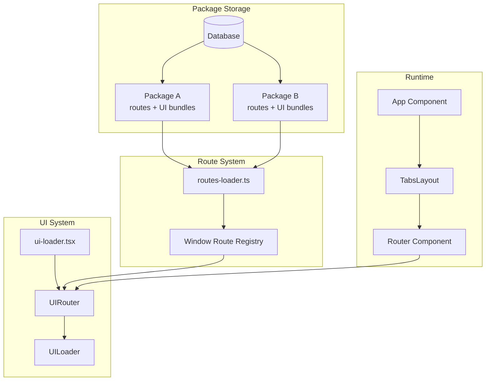
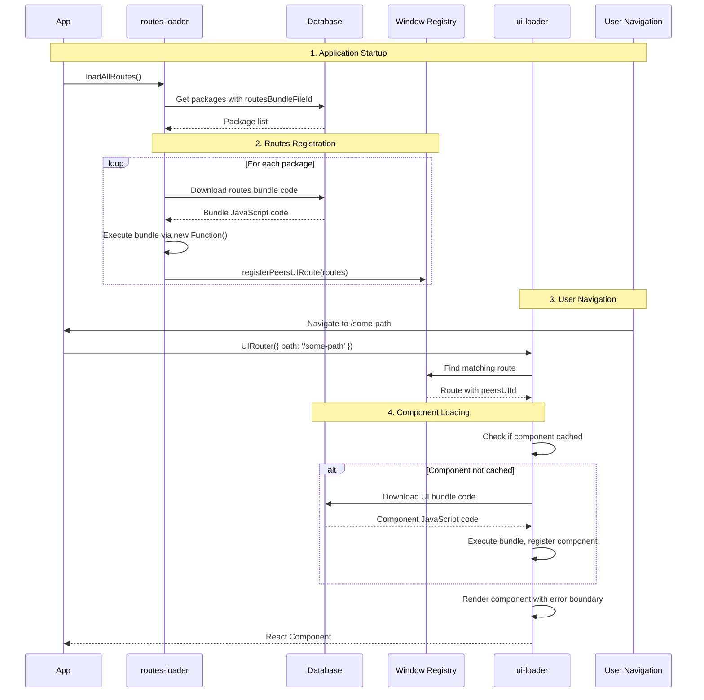

# Peers UI Framework - Getting Started Guide

## Overview

The Peers UI Framework is a dynamic, package-based system that allows loading and rendering user-created UI components at runtime. It consists of two main systems working together: **Route Loading** and **UI Component Loading**.

## Key Concepts

### **Packages**
- Self-contained bundles of code stored in the database
- Each package can contain both route definitions and UI components
- Packages have `routesBundleFileId` and `uiBundleFileId` fields

### **Routes**  
- Define which URLs map to which UI components
- Support path matching, props validation, and conditional rendering
- Registered globally and matched dynamically

### **UI Components**
- React components loaded on-demand from package bundles
- Wrapped in error boundaries for safe loading
- Support props validation with Zod schemas

## System Architecture



## Loading Sequence



## Route Registration Flow

### 1. **Package Discovery**
```typescript
// routes-loader.ts finds packages with UI capabilities
let packagesWithUI = await Packages().list({
  disabled: { $ne: true },
  routesBundleFileId: { $exists: true },
});
```

### 2. **Route Bundle Execution**
```typescript
// Download and execute route bundle code
const bundleCode = await rpcServerCalls.getFileContents(pkg.routesBundleFileId);
const exportRoutes = (peerRoutes) => {
  peerRoutes.routes.forEach(route => {
    window.registerPeersUIRoute(route); // Register globally
  });
}
const bundleFunction = new Function('exportRoutes', bundleCode);
bundleFunction(exportRoutes);
```

### 3. **Route Matching**
```typescript
// UIRouter matches incoming paths against registered routes
const allRoutes = window.getPeersUIRoutes();
const matchingRoute = allRoutes.find(route => {
  // Path matching (supports regex)
  // Props validation  
  // Conditional matching via isMatch()
});
```

## UI Component Loading Flow

### 1. **Component Discovery**
```typescript
// UIRouter delegates to UILoader with matched route
return UILoader({ peersUIId: matchingRoute.peersUIId, props });
```

### 2. **Bundle Loading**
```typescript
// Download UI bundle if not cached
const bundleCode = await rpcServerCalls.getFileContents(pkg.uiBundleFileId);
const exportUIs = (peerUIs) => {
  peerUIs.uis.forEach(ui => {
    peersUIs[ui.peersUIId] = ui; // Cache component
  });
}
const bundleFunction = new Function('exportUIs', bundleCode);
bundleFunction(exportUIs);
```

### 3. **Component Rendering**
```typescript
// Render cached component with error boundary
const Component = peersUI.content;
return (
  <UIErrorBoundary peersUIId={peersUIId}>
    <Component {...props} />
  </UIErrorBoundary>
);
```

## Error Handling

The framework provides comprehensive error handling:

### **Route Loading Errors**
- Invalid bundle code execution
- Missing route bundle files
- Network failures during download

### **UI Component Errors**
- Bundle loading failures with retry mechanism
- Props validation errors with detailed feedback
- Runtime component errors with error boundaries

### **Error UI Examples**
```typescript
// Bundle Loading Error
<div style={{ border: '2px solid #ff6b6b' }}>
  <h3>Bundle Loading Error</h3>
  <div>Package: {pkg.name}</div>
  <button onClick={retry}>Retry Loading</button>
</div>

// Props Validation Error  
<div>Props did not match schema</div>
<pre>{JSON.stringify(validationError, null, 2)}</pre>
```

## Integration Points

### **System Apps vs Package Apps**

| System Apps | Package Apps |
|-------------|--------------|
| Built into peers-ui | Loaded from database |
| Direct router integration | Dynamic route registration |
| Immediate availability | Async loading required |
| Examples: Tools, Assistants | Examples: Custom user apps |

### **TabsLayout Integration**
```typescript
// System apps integrated directly
const systemApps = [assistantsApp, toolsApp, workflowsApp];

// Package apps discovered dynamically  
const [packages] = useObservable(allPackages);
const appPackages = packages.filter(p => !p.disabled && p.appNavs?.length);
```

### **Router Integration**
```typescript
// TabsLayout calls Router for content rendering
const renderTabContent = (tab) => {
  return <Router path={tab.path} />;
};

// Router attempts UIRouter before falling back to system routes
const ui = UIRouter({ path, props: {}, uiCategory: 'screen' });
if (ui) return ui;
// ... fallback to system routes
```

## Development Workflow

### **Creating a New Package App**

1. **Create Route Bundle**: Define routes that map paths to component IDs
2. **Create UI Bundle**: Implement React components with props validation
3. **Package Registration**: Store bundles in database with proper file IDs
4. **App Navigation**: Add app navigation metadata for tabs integration

### **Package Bundle Structure**
```javascript
// Route Bundle (executed at startup)
exportRoutes({
  routes: [{
    peersUIId: 'my-component-id',
    path: '/my-app',
    uiCategory: 'screen',
    propsSchema: z.object({ id: z.string() }),
    isMatch: (props, context) => true
  }]
});

// UI Bundle (loaded on-demand)  
exportUIs({
  uis: [{
    peersUIId: 'my-component-id',
    content: MyReactComponent,
    propsSchema: z.object({ id: z.string() })
  }]
});
```

## Performance Characteristics

### **Optimizations**
- **Lazy Loading**: UI bundles loaded only when needed
- **Caching**: Components cached in memory after first load
- **Bundle Splitting**: Routes and UI separated for faster startup
- **Error Boundaries**: Component failures don't crash entire app

### **Bundle Size Impact**
- Small route bundles loaded at startup (fast)
- Large UI bundles loaded on-demand (UX optimized)
- Each package isolated (no dependency conflicts)

## Next Steps

- **[System Apps Guide](architecture/system-apps.md)** - Learn system app patterns
- **[Router Patterns](architecture/router-patterns.md)** - Advanced routing techniques  
- **[Component Library](components/component-library.md)** - Reusable UI components
- **[Groups Implementation Example](examples/groups-implementation.md)** - Real-world implementation guide

This framework enables a truly extensible application where users can create and share custom UI components while maintaining system stability and performance.