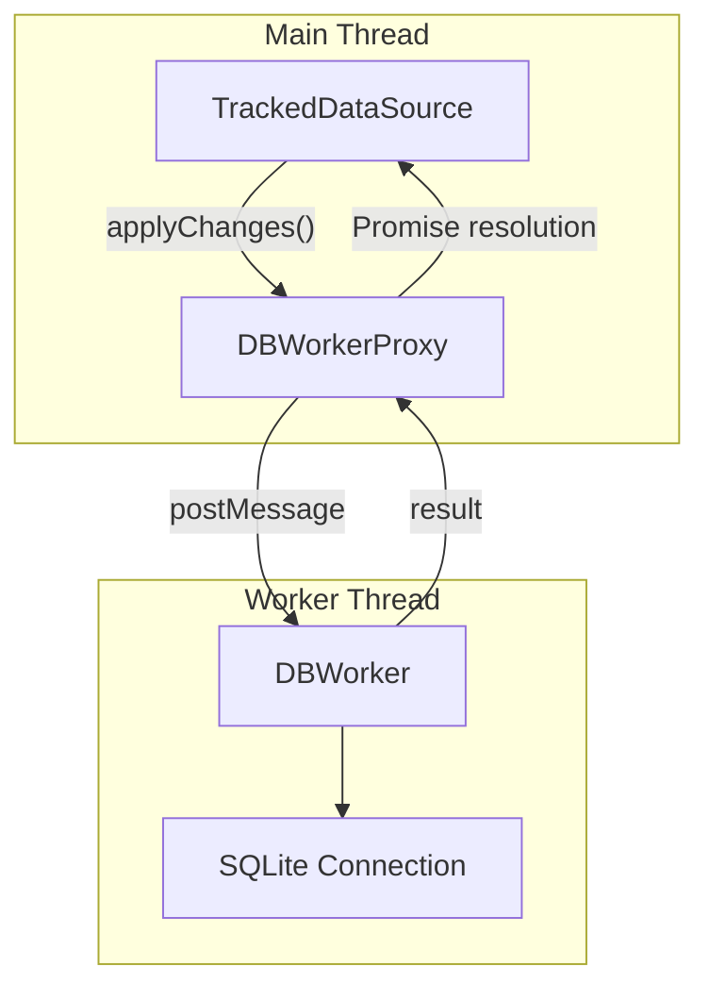

# Move Database Operations to Worker Threads

## Overview

Create a worker thread architecture to offload heavy DB operations (especially `applyChanges`) from the main thread, improving UI responsiveness and enabling parallel read operations. The solution uses Node.js `worker_threads` for Electron/services and provides an abstraction layer for future React Native support.

## Architecture

## Implementation Strategy

### Phase 1: DB Worker Infrastructure

Create a worker thread that owns its own SQLite connection and handles DB operations:

1. **New file: `peers-device/src/db-worker/db-worker.ts`**
   - Worker entry point that receives messages and performs DB operations
   - Creates its own `DBLocal` instance with the same config as main thread
   - Handles: `applyChanges`, bulk operations, `findAndTrackRecords`

2. **New file: `peers-device/src/db-worker/db-worker-proxy.ts`**
   - Main-thread class that wraps communication with the worker
   - Implements promise-based API over message passing
   - Handles worker lifecycle (spawn, terminate, error recovery)

3. **New file: `peers-device/src/db-worker/worker-types.ts`**
   - Shared type definitions for messages between main thread and worker

### Phase 2: Integrate with TrackedDataSource

Modify [`tracked-data-source.ts`](../peers-device/src/tracked-data-source.ts) to optionally delegate heavy operations to the worker:

- Add optional `dbWorker` parameter to constructor
- Route `applyChanges` and `findAndTrackRecords` through worker when available
- Keep synchronous path for environments without worker support
- Emit events after worker completes (events stay on main thread)

### Phase 3: Wire Up in Initialization

Update [`main.ts`](../peers-device/src/main.ts) to:
- Initialize DB worker at startup
- Pass worker reference to `TrackedDataSource` instances
- Handle graceful shutdown

## Key Design Decisions

1. **Each worker gets its own DB connection** - SQLite requirement; WAL mode allows concurrent reads
2. **Heavy operations only** - Simple reads/writes stay on main thread to avoid serialization overhead
3. **Serializable messages** - `IChangeRecord[]` and results are JSON-serializable
4. **Graceful fallback** - If worker unavailable, operations run on main thread (existing behavior)

## Platform Support

| Platform | Support | Mechanism |
|----------|---------|-----------|
| Electron | Full | `worker_threads` |
| peers-services | Full | `worker_threads` |
| React Native | Future | Would need `react-native-workers` or native module |

## Files to Create/Modify

| File | Action |
|------|--------|
| `peers-device/src/db-worker/db-worker.ts` | Create |
| `peers-device/src/db-worker/db-worker-proxy.ts` | Create |
| `peers-device/src/db-worker/worker-types.ts` | Create |
| `peers-device/src/db-worker/index.ts` | Create |
| `peers-device/src/tracked-data-source.ts` | Modify |
| `peers-device/src/main.ts` | Modify |

## Implementation Todos

1. Create worker message types and interfaces
2. Implement DB worker thread with SQLite connection
3. Create main-thread proxy for worker communication
4. Integrate worker into TrackedDataSource for applyChanges
5. Wire up worker initialization in main.ts
6. Add tests for worker thread operations

