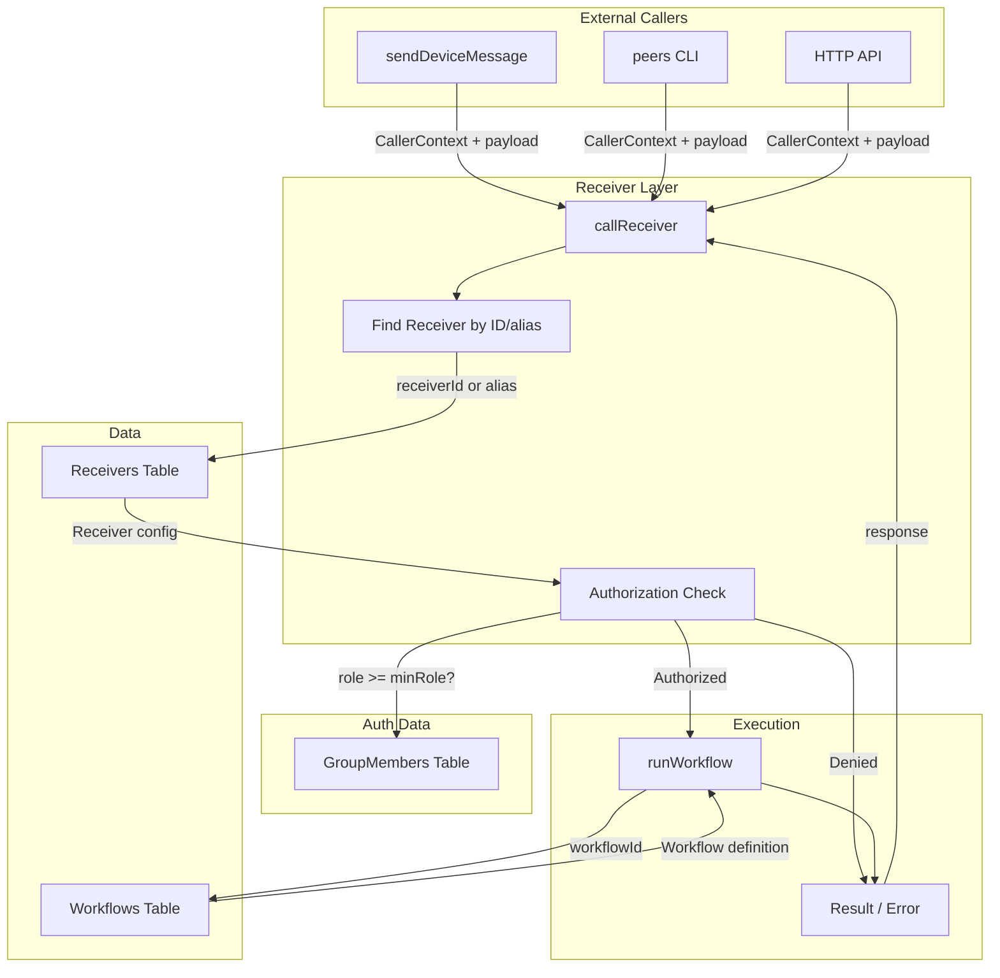
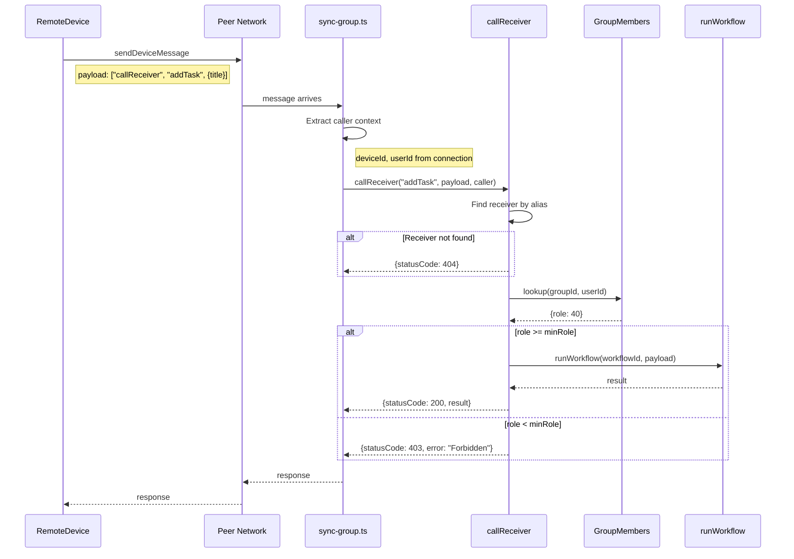
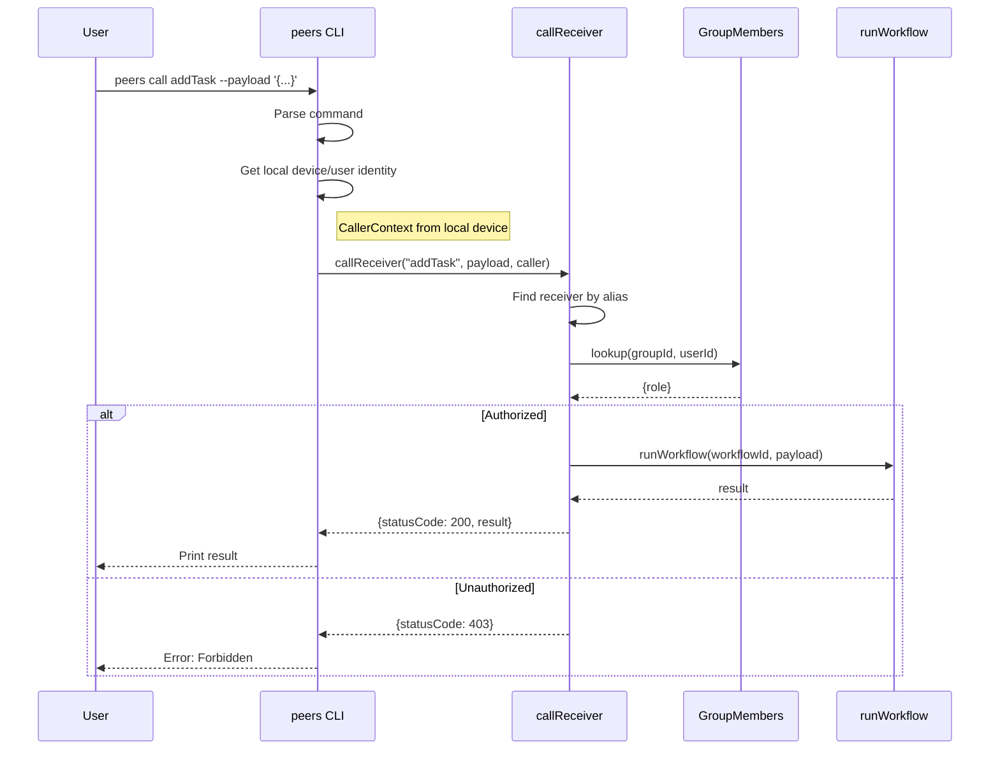

# Receivers

A **Receiver** is a configuration that exposes a workflow for remote calling with role-based authorization.

## Why Receivers (not Routers)

We originally considered a "Router" concept with path-based pattern matching, but realized we were over-complicating what's really just "remote workflow calls with authorization."

Workflows already have:
- Names/IDs
- Input schemas
- Execution logic

Receivers just add:
- "Can this be called remotely?"
- "Who is allowed to call it?"

## Architecture



## Sequence Diagrams

### sendDeviceMessage Flow



### CLI Flow



## Data Model

```typescript
const receiverSchema = z.object({
  receiverId: z.string(),
  workflowId: z.string(),                    // Workflow to execute
  
  alias: z.string().optional(),              // Human-friendly name for CLI/API
  
  // Authorization
  minRole: z.nativeEnum(GroupMemberRole)     // Minimum role level required
           .default(GroupMemberRole.Reader),
  
  description: z.string().optional(),
});
```

## Authorization Logic

1. Look up caller's `GroupMember` role in current data context
2. If `role >= minRole` → **allowed**
3. Otherwise → **denied**

This uses the existing `GroupMemberRole` enum:
- None = 0
- Reader = 20
- Writer = 40
- Admin = 60
- Owner = 80
- Founder = 100

## Caller Context

```typescript
interface CallerContext {
  deviceId?: string;   // From verified handshake
  userId?: string;     // From handshake OR resolved externally from token
}
```

**Token resolution is external.** The transport layer (sendDeviceMessage handler, HTTP server, CLI) resolves tokens to userId before calling the Receiver. This keeps Receivers simple and focused.

## API

```typescript
// Find receiver by ID or alias
function getReceiver(receiverIdOrAlias: string): Promise<IReceiver | undefined>

// Main entry point - runs the workflow if authorized
async function callReceiver(
  receiverIdOrAlias: string,
  payload: Record<string, any>,
  caller: CallerContext,
  dataContext?: DataContext
): Promise<{
  statusCode: number;      // 200, 401, 403, 404, 500
  result?: any;
  error?: string;
}>
```

## Usage Example

```typescript
// Create a receiver
await Receivers().insert({
  receiverId: newid(),
  workflowId: 'wf_add_task',
  alias: 'addTask',
  minRole: GroupMemberRole.Writer,  // Writers and above can call
  description: 'Add a new task',
});

// Call it remotely (from another device)
const result = await sendDeviceMessage({
  toDeviceId: targetDevice,
  payload: ['callReceiver', 'addTask', { title: 'Buy milk' }],
});
```

## Integration Points

### sendDeviceMessage

```typescript
// Message format: ['callReceiver', receiverIdOrAlias, payload]
if (isArray(message.payload) && message.payload[0] === 'callReceiver') {
  const [, receiverIdOrAlias, payload] = message.payload;
  const caller = { deviceId, userId };
  return callReceiver(receiverIdOrAlias, payload, caller);
}
```

### CLI (future)

```sh
peers call addTask --payload '{"title": "Buy milk"}'
```

### HTTP (future)

```
POST /api/call/addTask
Authorization: Bearer <token>
Content-Type: application/json

{"title": "Buy milk"}
```

The HTTP server resolves the token to userId, then calls `callReceiver()`.

## Replaces

The legacy `peers-sdk` Peer Events module (`PeerEventTypes` / `PeerEventHandlers` / `PeerEvents`) has been removed; table `dataChanged` subscriptions and sync cover those use cases. Once Receivers + Scheduler + DataEventHandler are complete, remaining gaps should be addressed there—not by reviving peer-events.

## Related Concepts

- **Scheduler** (future): Calls workflows on a CRON schedule
- **DataEventHandler** (future): Pre/post hooks on table CUD operations

