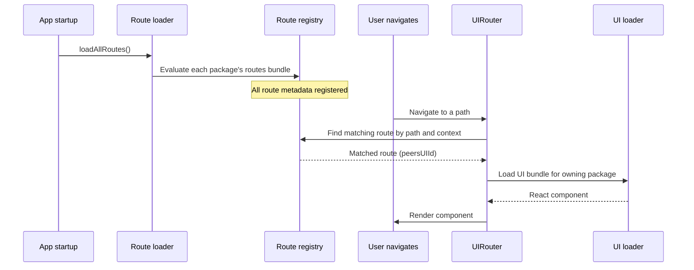

# Routes and UI

Peers packages split their browser-side code into two bundles with distinct loading strategies:

| Bundle | File | Loaded | Contains |
|--------|------|--------|----------|
| **Routes** | `routes.bundle.js` | Eagerly at startup | Path/context metadata, optional match logic |
| **UI** | `uis.bundle.js` | Lazily on first render | React components |

A third piece of data, **`appNavs`**, lives directly on the `IPackageVersion` record as JSON. It tells the Apps launcher what navigation items exist without loading any code at all.

This architecture ensures that adding more packages does not degrade startup or runtime performance — only the screens a user actually visits get loaded into memory. For initial project setup, see **[Getting started](./getting-started)**.

## How it works



1. At startup, every installed package's **routes bundle** is evaluated. Each bundle calls `exportRoutes()` to register its `IPeersUIRoute` entries in a global in-memory registry.
2. When the user navigates, `UIRouter` matches the current path and context against registered routes.
3. The first matching route identifies a `peersUIId`. If that component isn't in memory yet, the owning package's **UI bundle** is fetched and evaluated, registering its React components.
4. The component renders. Subsequent navigations to the same component are instant (already loaded).

## appNavs, routes, and UI bundles

These three concepts serve different purposes in the package lifecycle:

**appNavs** are declarative metadata stored on the `IPackageVersion` record. They populate the Apps tab in the launcher so users can see what apps are available. An `IAppNav` has a `name`, `iconClassName`, and `navigationPath` — no executable code.

**Routes** (`routes.bundle.js`) are a lightweight JavaScript bundle that registers URL-path-to-component mappings. Routes can contain logic (e.g., an `isMatch` function that parses a path and extracts an ID), which is why they must be a bundle rather than a JSON field. They are loaded eagerly so the runtime knows how to resolve any path before the user navigates.

**UI** (`uis.bundle.js`) contains the actual React components. This is typically the largest bundle and is loaded lazily — only when the user first visits a route that needs a component from it.

## Authoring routes

Create a `src/routes.ts` file with your route definitions. This file should contain **no React imports** — it is built as a separate webpack entry to keep the bundle small. From the [peers-package-template](https://github.com/peers-app/peers-package-template):

```typescript
import type { IPeersPackageRoutes, IPeersUIRoute } from "@peers-app/peers-sdk";
import { appScreenId, packageId } from "./consts";

const appScreenRoute: IPeersUIRoute = {
  packageId,
  peersUIId: appScreenId,
  path: `package-nav/${packageId}/app`,
  uiCategory: "screen",
};

const routes: IPeersPackageRoutes = {
  routes: [appScreenRoute],
};

declare const exportRoutes: (routes: IPeersPackageRoutes) => void;
exportRoutes(routes);
```

Key points:

- **`packageId`** — your package's 25-character peer ID. Used to associate the route with your UI bundle.
- **`peersUIId`** — a stable ID that maps to a specific React component in your UI bundle.
- **`path`** — the URL path this route handles. For package app screens, use `package-nav/{packageId}/{navPath}` to match the tab navigation path.
- **`uiCategory`** — `"screen"` for full-page views, `"field"` for inline field renderers, `"list"` for list views, etc.
- **`declare const exportRoutes`** — tells TypeScript about the function that the runtime injects when evaluating the bundle. Do not import it.

Build the routes bundle with a dedicated webpack config (entry: `src/routes.ts`, output: `dist/routes.bundle.js`). The template includes a working `webpack.routes.config.js`.

## Authoring UI components

Create a `src/uis.ts` file that collects your React components. From the [peers-package-template](https://github.com/peers-app/peers-package-template):

```typescript
import type { IPeersPackageUIs } from "@peers-app/peers-sdk";
import { AppScreenUI } from "./ui/app";

const uis: IPeersPackageUIs = {
  uis: [AppScreenUI],
};

declare const exportUIs: (uis: IPeersPackageUIs) => void;
exportUIs(uis);
```

Each component is wrapped as an `IPeersUI` object in the component file (`src/ui/app.tsx`):

```typescript
import type { IPeersUI } from "@peers-app/peers-sdk";
import { zodAnyObjectOrArray } from "@peers-app/peers-sdk";
import { appScreenId } from "../consts";

export function AppScreen() {
  // Your React component
}

export const AppScreenUI: IPeersUI = {
  peersUIId: appScreenId,
  content: AppScreen,
  propsSchema: zodAnyObjectOrArray,
};
```

- **`peersUIId`** — must match the ID used in the corresponding route definition.
- **`content`** — the React component to render.
- **`propsSchema`** — a Zod schema that validates props before rendering. Use `zodAnyObjectOrArray` to accept any props, or define a specific schema for type safety.

Build the UI bundle with a dedicated webpack config (entry: `src/uis.ts`, output: `dist/uis.bundle.js`). The template includes a working `webpack.uis.config.js`. React, `@peers-app/peers-sdk`, `@peers-app/peers-ui`, and `zod` must be listed as **externals** since the runtime provides them as globals.

## Route matching

When `UIRouter` receives a navigation request, it selects a route through the following steps:

1. **Context filtering** — routes are filtered by `uiEditMode`, `uiCategory`, and `uiSubcategory`. A route with `"*"` for any of these matches all values.

2. **Path matching** — if the route specifies a `path`:
   - If the path looks like a regex (`/pattern/flags`), it is tested against the current path.
   - Otherwise, it is treated as a prefix match.

3. **Schema validation** — if the route has a `propsSchema`, the caller's props must pass Zod validation.

4. **Custom matching** — if the route has an `isMatch` function, it receives the props and context. This function can also inject derived values into props (e.g., extracting an ID from the path):

   ```typescript
   isMatch: (props, context) => {
     const match = context.path.match(/^groups\/([a-zA-Z0-9]{25})$/);
     if (match) {
       props.groupId = match[1];
       return true;
     }
     return false;
   }
   ```

5. **Priority** — routes are sorted by `priority` (higher wins) at registration time. The first route that passes all checks is selected.

## Extensible rendering with `PeersUI`

The `<PeersUI>` component (from `@peers-app/peers-sdk`) lets any package render a UI slot that other packages can fill. This is the core extensibility mechanism.

**Rendering a slot** — a package requests a UI for a given context:

```tsx
import { PeersUI } from "@peers-app/peers-sdk";

// Render whatever component is registered for markdown fields
<PeersUI uiCategory="field" uiSubcategory="markdown" uiEditMode="view" props={{ value: content }} />
```

**Filling a slot** — another package registers a route that matches that context, and its component will be rendered in place.

This enables:
- **Field-level customization** — a package can provide a custom renderer for any data type.
- **Screen overrides** — a third-party package can replace a built-in screen by registering a higher-priority route for the same path.
- **Composable UI** — packages can render `<PeersUI>` slots within their own components, letting other packages extend them without coordination.

When using `<PeersUI>` with a specific `peersUIId`, it bypasses matching and loads the component directly — useful when you know exactly which component you want.

## Why prefer route-based routing

Many packages currently use in-memory component-based routing — importing all screens at the top level and switching between them with state. This works but has drawbacks as the ecosystem grows:

| | In-memory routing | Route-based routing |
|---|---|---|
| **Startup cost** | All components loaded immediately | Only route metadata loaded; components lazy |
| **Memory** | Every screen in memory even if unused | Only visited screens loaded |
| **Extensibility** | Other packages cannot override or extend | Any package can register routes for any path or context |
| **Scalability** | Each new screen adds to the initial bundle | New screens are isolated bundles loaded on demand |

For packages with a single simple screen, in-memory routing is fine. But for packages with multiple views — or any package that wants to participate in the cross-package extensibility system — route-based routing is the recommended approach.
