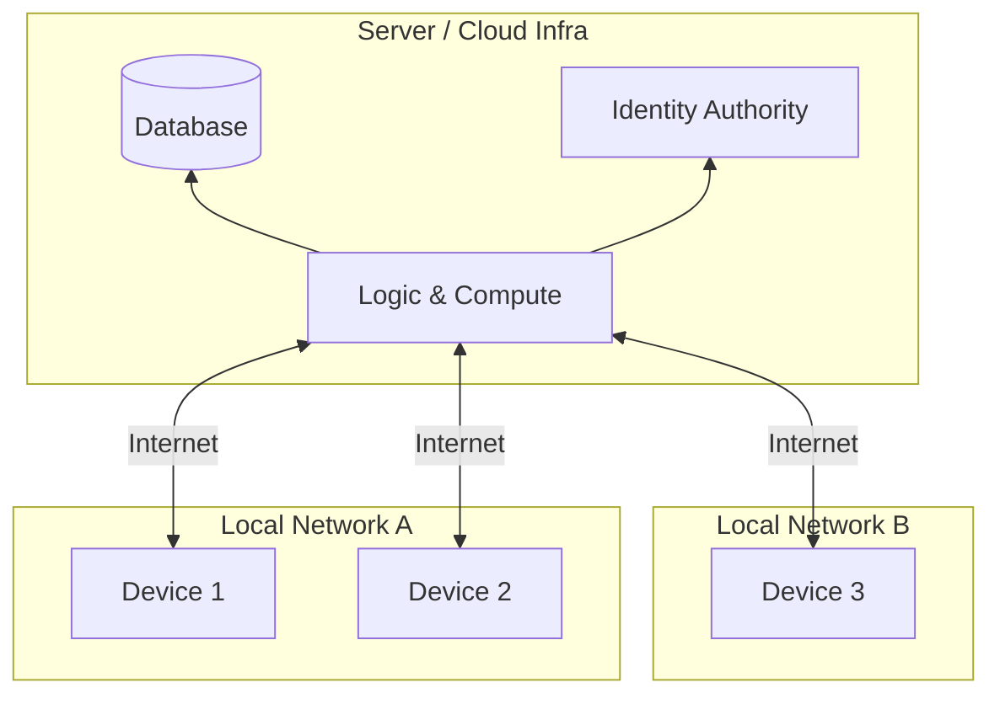
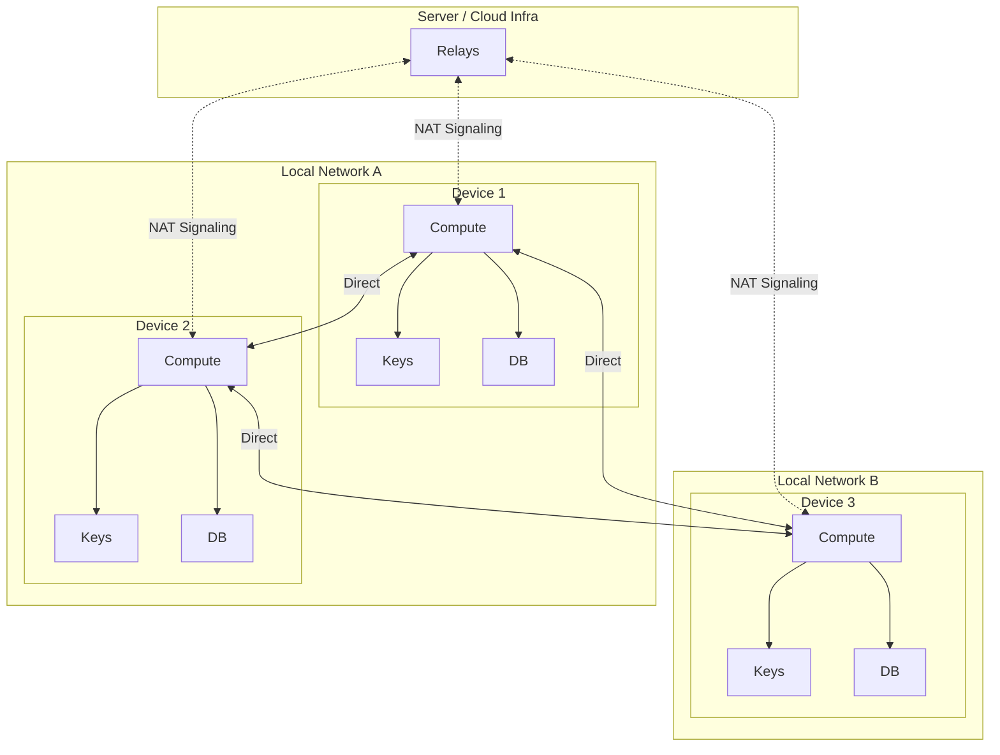
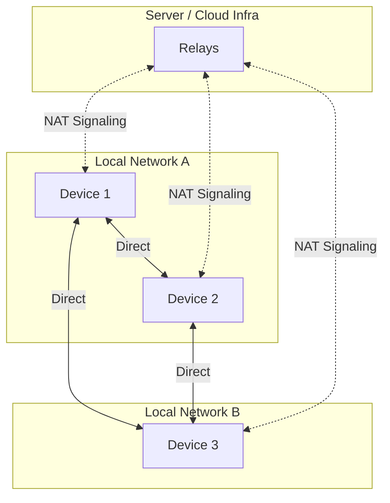

# The Three Problems of Servers

Servers solve three hard problems in an easy and straightforward way but, as is common in software, the easy and obvious solution creates tech debt - the cost of which has been continually growing for decades. Peers wants to finally pay down that tech debt. 

## The Three Problems

1. **Network Traversal**
	- The internet is a network of networks. Two arbitrary devices typically cannot connect directly because most are behind NAT (Network Address Translation) and don't have publicly accessible IP addresses. A server with a public IP address acts as a rendezvous point, enabling devices to discover and connect to each other.

2. **Authentication & Authorization**
	- Devices don't have a built-in way to uniquely and securely identify themselves. Since servers already act as a central connection point, it makes sense for them to also verify that a device is who they claim to be and has permission to perform the requested action.  This is done with a variety of mechanisms but virtually all are based on the concept of a "shared secret" (the user's password).

3. **Source of Truth**
	- Once two or more devices are involved, correctly propagating data changes to all devices becomes a key problem. Servers solve this by acting as a single authoritative source for reading and writing data.
	- This naturally extends to code and logic. By also keeping logic on servers, all clients stay synchronized without explicit updates. This greatly simplifies - or in the case of web apps, eliminates - the complex process of distributing application updates. However, this approach requires clients to always be online and can create server bottlenecks as scale increases.

## Tradeoffs

While servers elegantly solve these three fundamental problems of network applications, they introduce their own challenges:

1. **Single Point of Failure**
	- If the server (or any component it relies on) goes down, all connected devices lose access and usually stop working completely. This makes server-based systems naturally brittle and harder to scale reliably without significant infrastructure investment.  
    
2. **Security Targets**
	- Servers become centralized targets for attackers seeking to compromise identity data, user information, or application data. A single breach can expose all users.

3. **Complexity & Cost Overhead**
	- Applications require server infrastructure, ongoing maintenance, monitoring, and scaling. This adds operational complexity and recurring costs that must be managed throughout the application's lifetime.
    - For many applications this overhead makes them infeasible just from a cost perspective.

4. **Always-Online Requirement**
	- Clients must maintain internet connectivity to access data and functionality. Offline capabilities become difficult to implement and maintain consistency.
    - Even if all devices and the server are on the same local network, many applications stop working when the internet connection goes down. This is because they're designed to communicate through cloud infrastructure or require external authentication services, highlighting how deeply the server-centric model depends on continuous, uninterrupted internet connectivity.

5. **Privacy & Control**
	- Users must trust server operators with their data and identity. This centralized control limits user autonomy and creates potential for misuse or surveillance.

## Peers Alternative

While the server-based solution solves the three fundamental problems in a straightforward way, the tradeoffs are significant. Organizations constantly pour resources into managing infrastructure, securing centralized data, and ensuring uptime - all to address problems created by the server-centric approach itself.

More importantly, this overhead creates a barrier to entry that prevents countless useful applications from ever being built. **How many valuable applications don't exist simply because the cost and complexity of server infrastructure makes them infeasible?** 

This makes it worthwhile to revisit the three fundamental problems and explore alternative solutions. After having done so, we've selected an approach to each one of these problems which prioritizes decentralized, local-first, applications.  We call the resulting framework and runtime Peers.  

With Peers, building and deploying a networked application becomes as easy and inexpensive as building a traditional standalone application - no servers to provision, no infrastructure to maintain, no recurring operational costs.

1. **Network Traversal**
	- Local connectivity isn't actually a problem - devices can easily discover each other when they're on the same subnet. 
    - For connections across networks, WebRTC is an existing, secure, proven technology for establishing direct connections between devices.  Unfortunately this still requires a signaling server. The good news is there are free-to-use signaling servers offered by Google and Twilio as well as many open-source options. These are very simple and stateless servers without any special logic or sensitive data.

2. **Authentication & Authorization**
	- Instead of relying on a central authority, devices can use public-private key cryptography. This is objectively more secure since secrets (passwords) never need to be shared or stored on a central server. Each user owns and retains complete control of their private key. Identity verification happens through cryptographic signatures.

3. **Source of Truth for Data**
	- This is the trickiest problem and the most difficult to fully solve in a peer-to-peer architecture. However, a specialized database layer that tracks and syncs changes using last-write-wins per field solves this in a generalized way that works for the vast majority of use cases. Each device maintains its own copy of the data and synchronizes changes with peers.  Syncing is transitive so each device only has to sync with one other "fully-synced" device to itself be completely up-to-date. 

By rethinking these problems, we can build applications that avoid the centralized tradeoffs while still providing reliable connectivity, security, and data consistency. 

This diagram may look more complicated than the server-based architecture, but that's only because each device contains everything it needs to run the full application - compute, identity (keys), and data (database). In the server model, these components are centralized and hidden behind a single entry point. The peer-to-peer model distributes them across devices, which adds visual complexity but eliminates the single point of failure and centralized control.

Here's a simplified view that shows the architecture at the device level:

## Peers Tradeoffs

The peer-to-peer approach eliminates many server-related problems, but it introduces its own set of challenges that users and developers must consider:

1. **Key Management Responsibility**
	- Users must securely manage their private keys. If a key is lost, access to identity and encrypted data is lost. If a key is compromised, security is breached. This shifts responsibility from a service provider to the individual user, who may not be accustomed to this level of security management.

2. **Data Backup Responsibility**
	- With no central server storing data, users are responsible for their own backups. If all devices with a copy of the data are lost or damaged, the data is gone. Users accustomed to "the cloud" automatically backing up their information need to adopt new habits and use backup strategies.

3. **Device Availability for Sync**
	- For data changes to propagate across the network, at least two devices must be online simultaneously to sync. While syncing is transitive (a device only needs to sync with one fully-synced peer), this still means data won't reach all devices instantly if they're never online at the same time. This can lead to temporary inconsistencies or delays in data availability.

4. **Increased Client Complexity**
	- Each device runs the full application stack including database, sync logic, and cryptography. This increases the computational requirements and storage needs on client devices compared to thin clients that rely on servers for heavy lifting.

5. **Peer Discovery**
	- Users need a way to discover and connect with each other by sharing public keys. While this can be done in person (via QR codes, for example), connecting over the internet requires some form of directory or registry - like a phone book for public keys. This isn't necessarily a problem and can even be a benefit, as users have control over whether they want to be discoverable and can choose from multiple discovery mechanisms. However, it does require a solution where the traditional server model provides built-in user directories.

These tradeoffs represent a shift in the responsibility model: from trusting a centralized service provider to taking direct control and ownership. For some users and use cases, this exchange - trading convenience for privacy, control, and resilience - is worthwhile. For others, the additional responsibility may outweigh the benefits.

## Peers Services

While the core Peers architecture is fully decentralized and self-contained, Peers Services offers optional, opt-in conveniences that address some of the tradeoffs mentioned above. These services are non-essential - the platform works perfectly without them - but they provide a bridge for users who want peer-to-peer benefits with some traditional cloud conveniences.

1. **Automated Backups**
	- Peers Services can automatically back up your data to encrypted cloud storage. You maintain control of your encryption keys, but the backup process is handled seamlessly in the background, similar to traditional cloud services.

2. **Sync Buffer**
	- A sync buffer stores recent changes (e.g., the last two weeks) that peers can read and write even when other devices are offline. This reduces the synchronization timing requirements and ensures that changes propagate more reliably across devices that aren't online simultaneously.

3. **Cloud Peer VMs**
	- Users can provision a cloud-based peer node - a virtual machine that acts as an always-on device in your peer network. You own and control this peer, but Peers Services manages the infrastructure. This ensures at least one device is always available for syncing and provides a reliable presence for your data and compute.

4. **Managed Key Services**
	- For users who prefer traditional username/password authentication, Peers Services can manage your private keys behind conventional login flows. Your keys are encrypted and stored securely, allowing you to access your identity across devices without manually managing key files. This trades some security sovereignty for familiar user experience.

5. **Public Key Registry**
	- Peers Services provides an optional public key directory that makes it easy for users to discover and connect with each other over the internet. Users can register their public keys with human-readable identifiers (like usernames or handles), making peer discovery as simple as traditional social platforms - while maintaining the decentralized, cryptographic security of the peer-to-peer model. Users retain full control over their discoverability settings.

**Important Note**: All Peers Services are optional and designed to complement - not replace - the core peer-to-peer architecture. Users can choose to use all, some, or none of these services based on their needs and comfort level. Even when using these services, your data remains encrypted end-to-end, and the fundamental peer-to-peer connectivity remains intact.

## Summary and Conclusion

Peers reimagines networked applications by addressing the fundamental tradeoffs of server-centric architecture:

**Problems Solved:**
- Eliminates single points of failure and centralized security targets
- Removes infrastructure complexity and ongoing operational costs
- Provides offline-first capabilities with local data access, logic and compute
- Returns privacy and control to users through decentralization and identity ownership

**New Challenges:**
- Users must manage their own private keys
- Data backup becomes a user responsibility
- Devices need to be online simultaneously for synchronization
- Client devices handle more computational complexity and significant storage requirements

**Tools to Overcome:**
- Optional Peers Services provide automated backups and managed keys
- Sync buffers reduce timing constraints for device availability
- Cloud Peer VMs offer always-on nodes without infrastructure management
- Transitive syncing minimizes coordination requirements between devices

By treating servers as technical debt that can be paid down, Peers demonstrates that the three fundamental problems - network traversal, authentication, and data consistency - can be solved without the centralized tradeoffs we've accepted for decades. The result is a new foundation for building applications where users maintain control, privacy is built-in by default, and resilience doesn't require massive infrastructure investment.

The choice between server-based and peer-to-peer architectures isn't about which is universally better - it's about which tradeoffs align with your values and use case. Peers provides the tools to make decentralization practical, with optional services to ease the transition for those who need them. 