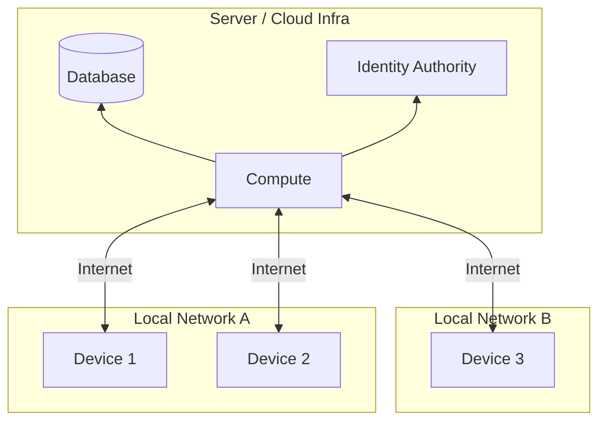
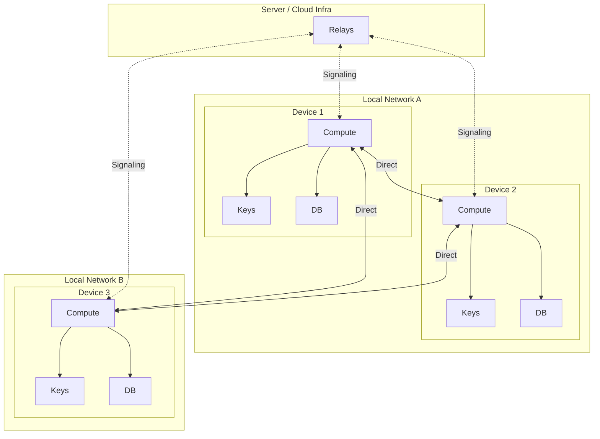
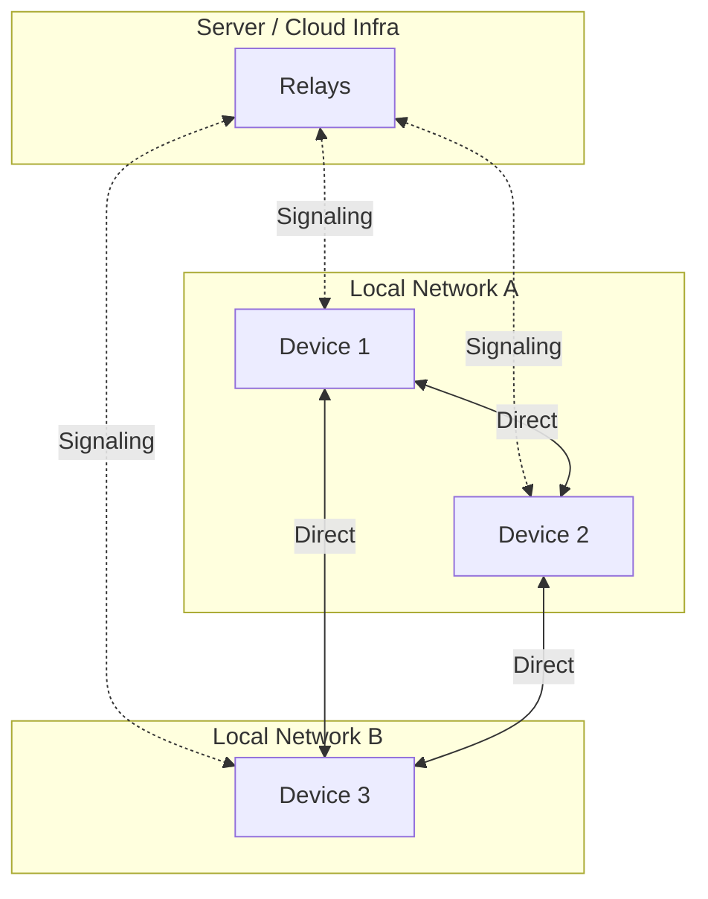

# Servers Solve Three Problems

### Notes
- Another way to frame this is "Servers are tech debt"
  - they solve the problem in an easy and straightforward way but also in a way that creates problems down the road
  - it's time to start paying back that tech debt and that's what Peers is working to do

1. Network Traversal
	- The internet is a network of networks. Two arbitrary devices typically cannot connect directly because most are behind NAT (Network Address Translation) and don't have publicly accessible IP addresses. A server with a public IP address acts as a rendezvous point, enabling devices to discover and connect to each other.
2. Authentication & Authorization
	- Devices don't have a standard way to uniquely and securely identify themselves. Since servers already act as a central connection point, it makes sense for them to also verify that a device is who they claim to be and has permission to perform the requested action.
3. Source of Truth for Data
	- Once two or more devices are involved, correctly propagating data changes to all devices becomes a key problem. Servers solve this by acting as a single authoritative source for reading and writing data.
	- This naturally extends to code and logic. By keeping data and logic on servers, all clients stay synchronized without explicit updates. This greatly simplifies - or in the case of web apps, eliminates - the complex process of distributing application updates. However, this approach requires clients to always be online and can create server bottlenecks as scale increases.

## Tradeoffs

While servers elegantly solve these three fundamental problems of network applications, they introduce their own challenges:

1. **Single Point of Failure**
	- If the server goes down, all connected devices lose access. This makes server-based systems naturally brittle and harder to scale reliably without significant infrastructure investment.

2. **Security Targets**
	- Servers become centralized targets for attackers seeking to compromise identity data, user information, or application data. A single breach can expose all users.

3. **Complexity & Cost Overhead**
	- Applications require server infrastructure, ongoing maintenance, monitoring, and scaling. This adds operational complexity and recurring costs that must be managed throughout the application's lifetime.

4. **Always-Online Requirement**
	- Clients must maintain internet connectivity to access data and functionality. Offline capabilities become difficult to implement and maintain consistency.

5. **Privacy & Control**
	- Users must trust server operators with their data and identity. This centralized control limits user autonomy and creates potential for misuse or surveillance.

## Peers Alternative

While the server-based solution solves the three fundamental problems in a straightforward way, the tradeoffs are significant. Organizations constantly pour resources into managing infrastructure, securing centralized data, and ensuring uptime - all to address problems created by the server-centric approach itself. This makes it worthwhile to revisit the three fundamental problems and explore alternative solutions.

1. **Network Traversal**
	- Local connectivity isn't actually a problem—devices can easily discover each other when they're on the same subnet. For connections across networks, we still need devices with global IP addresses to assist with NAT traversal, but these can be very simple, stateless relay servers without any special or sensitive data or logic.

2. **Authentication & Authorization**
	- Instead of relying on a central authority, devices can use public-private key cryptography. This is objectively more secure since secrets never need to be shared or stored on a central server. Each device owns its private key, and identity verification happens through cryptographic signatures.

3. **Source of Truth for Data**
	- This is the trickiest problem and the most difficult to fully solve in a peer-to-peer architecture. However, a specialized database layer built on top of SQLite that tracks and syncs changes using last-write-wins per field solves this in a generalized way that works for the vast majority of use cases. Each device maintains its own copy of the data and synchronizes changes with peers.  Syncing in transitive so each device only has to sync with one other "fully-synced" device to itself be completely up-to-date. 

By rethinking these problems, we can build applications that avoid the centralized tradeoffs while still providing reliable connectivity, security, and data consistency.

This diagram may look more complicated than the server-based architecture, but that's only because each device contains everything it needs to run the full application—compute, identity (keys), and data (database). In the server model, these components are centralized and hidden behind a single entry point. The peer-to-peer model distributes them across devices, which adds visual complexity but eliminates the single point of failure and centralized control.

Here's a simplified view that shows the essential architecture:

