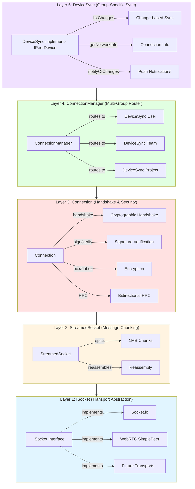
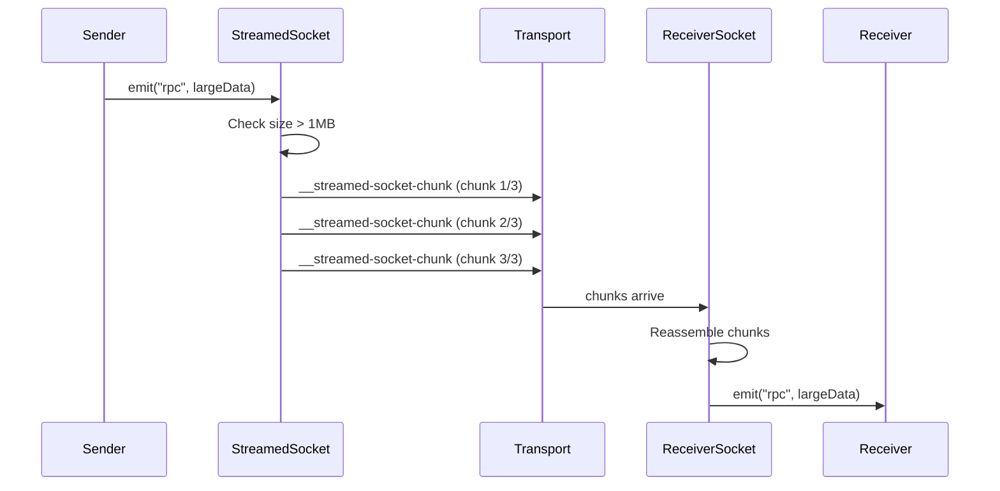
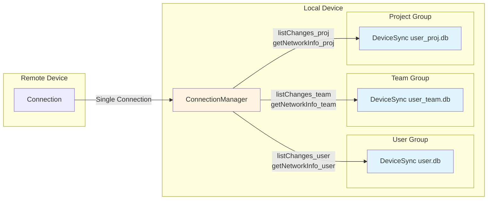
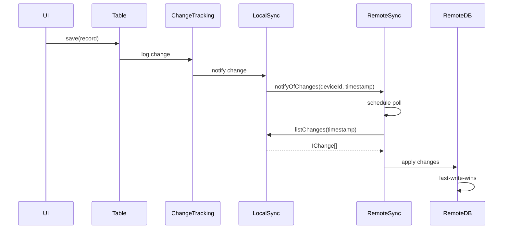
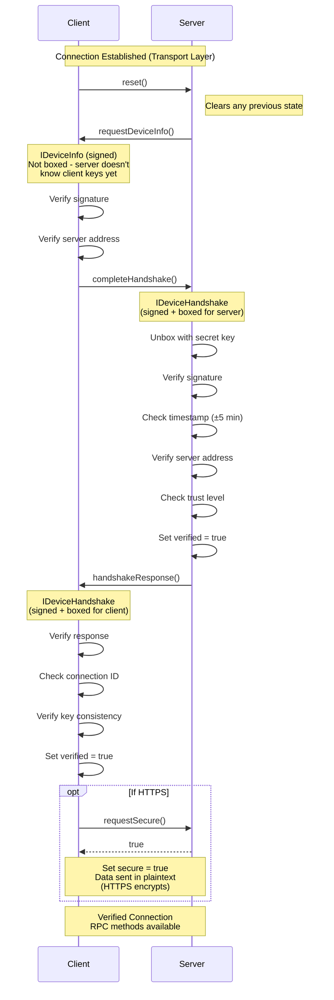
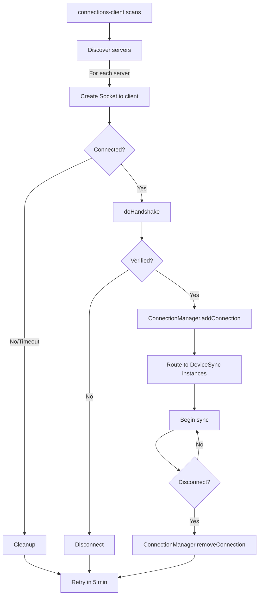

# Connections Architecture

## Overview

Peers uses a **transport-agnostic connection architecture** that supports multiple connection types (Socket.io, WebRTC, etc.) while maintaining consistent security, handshaking, and data synchronization across all transports.

The architecture is designed to:
- Work offline-first with automatic sync when connections become available
- Support multiple simultaneous connections per device
- Route a single physical connection to multiple groups
- Provide cryptographic security independent of transport layer
- Enable NAT traversal and peer-to-peer communication

---

## Layer Architecture

The connection system is built in five distinct layers, each with specific responsibilities:



### Layer 1: ISocket Interface

**Location**: `peers-sdk/src/device/socket.type.ts`

**Purpose**: Abstract transport layer supporting any bidirectional communication channel

```typescript
export interface ISocket {
  id?: string;
  connected?: boolean;
  emit(eventName: string, args: any, callback: RPCCallback): void;
  on(eventName: string, handler: ((...args: any[]) => void)): void;
  removeAllListeners(eventName: string): void;
  disconnect(): void;
}
```

**Key Features**:
- Transport-agnostic: works with Socket.io, WebRTC, or any custom transport
- RPC-style bidirectional communication with callbacks
- Event-based message handling
- Simple lifecycle management (connect/disconnect)

**Current Implementations**:
- ✅ Socket.io (fully implemented)
- 🚧 WebRTC SimplePeer (partial implementation in `wrap-wrtc.ts`)

---

### Layer 2: StreamedSocket

**Location**: `peers-sdk/src/device/streamed-socket.ts`

**Purpose**: Transparent message chunking for large data transfers



**Key Features**:
- Default 1MB chunk size (configurable)
- Transparent to upper layers
- Handles message fragmentation and reassembly
- Prevents transport buffer overflow
- Maintains message ordering

---

### Layer 3: Connection

**Location**: `peers-sdk/src/device/connection.ts`

**Purpose**: Cryptographic handshake, trust verification, and secure communication

```typescript
export class Connection {
  constructor(
    socket: ISocket,
    localDevice: Device,
    localDeviceServerAddresses?: string[],
    getTrustLevel: GetTrustLevel
  )

  // State
  verified: boolean;           // Handshake completed?
  secure: boolean;              // Using HTTPS?
  forceInsecure: boolean;       // Skip double-encryption (WebRTC)?
  trustLevel: TrustLevel;       // Trust relationship

  // Methods
  doHandshake(serverUrl: string): Promise<HandshakeResponse>;
  exposeRPC<T>(name: string, handler: RPCHandler<T>): void;
  emit<T>(eventName: string, args?: any): Promise<T>;
}
```

**Key Responsibilities**:
1. Execute cryptographic handshake (sign/box/verify/unbox)
2. Verify device identity and trust level
3. Manage secure vs insecure channels
4. Provide RPC method exposure and invocation
5. Handle connection lifecycle events

**Security Flags**:
- `verified`: Connection has completed handshake successfully
- `secure`: Connection is over HTTPS (or both peers agreed on secure channel)
- `forceInsecure`: Skip encryption because transport already encrypts (WebRTC)
- If `verified && !secure`: All RPC data is signed and boxed
- If `verified && secure`: Data sent in plaintext (HTTPS encrypts)

---

### Layer 4: ConnectionManager

**Location**: `peers-device/src/connection-manager/connection-manager.ts`

**Purpose**: Route single physical connection to multiple group-specific DeviceSync instances



**Key Features**:
- **Multi-group aware**: One connection serves multiple groups
- **RPC namespacing**: Each group gets unique RPC endpoints (`methodName_${groupId}`)
- **Connection pooling**: Maximum 30 connections per device
- **Automatic routing**: Inspects remote device's group membership
- **Cleanup**: Removes connections and RPC handlers on disconnect

**Per-Group RPC Registration**:
```typescript
// For each shared group, ConnectionManager exposes:
connection.exposeRPC(`getNetworkInfo_${groupId}`, () => syncDevice.getNetworkInfo());
connection.exposeRPC(`listChanges_${groupId}`, (...args) => syncDevice.listChanges(...args));
connection.exposeRPC(`notifyOfChanges_${groupId}`, (...args) => syncDevice.notifyOfChanges(...args));

// And creates IPeerDevice wrapper that remote DeviceSync uses:
remoteDevice = {
  deviceId, userId, role,
  getNetworkInfo: () => connection.emit(`getNetworkInfo_${groupId}`),
  listChanges: (...args) => connection.emit(`listChanges_${groupId}`, ...args),
  notifyOfChanges: (...args) => connection.emit(`notifyOfChanges_${groupId}`, ...args),
};
```

---

### Layer 5: DeviceSync

**Location**: `peers-device/src/device-sync.ts`

**Purpose**: Implement group-specific database synchronization using IPeerDevice interface

```typescript
export interface IPeerDevice {
  deviceId: string;
  userId: string;
  role: GroupMemberRole;

  // Sync methods
  listChanges(filter?, opts?): Promise<IChange[]>;
  getNetworkInfo(): Promise<INetworkInfo>;
  notifyOfChanges(deviceId, timestamp): Promise<void>;
}
```

**Change-Based Synchronization**:



**Key Features**:
- **Incremental sync**: Only transmits changes since last sync
- **Change tracking**: Every table operation creates change record
- **Batching**: Groups changes within 100ms window
- **Conflict resolution**: Last-write-wins based on timestamp
- **Full resync**: Every 1 minute as safety fallback
- **Preferred connections**: Elects most reliable peer

---

## Handshake Protocol

The handshake protocol provides cryptographic verification of device identity and establishes trust, independent of the underlying transport.



**Security Properties**:

1. **Mutual Authentication**: Both sides verify the other's cryptographic identity
2. **Replay Protection**: Timestamp must be within ±5 minutes
3. **MITM Detection**: Address verification prevents man-in-the-middle attacks
4. **Trust Levels**: Connection rejected if trust level insufficient
5. **Forward Secrecy**: Optional boxing provides encryption even on insecure transport

**Trust Levels**:
```typescript
enum TrustLevel {
  Unknown = 0,          // Never seen before - reject
  Registered = 1,       // Registered with peers.app service
  DirectlyConnected = 2, // Currently connected
  PreviouslyConnected = 3, // Was connected in the past
}
```

---

## Current Implementations

### Socket.io (Complete)

**Receiver Side**: `peers-electron/src/server/connections/connections-server.ts`
- Creates Socket.io server on configurable port (default 3333)
- Listens for incoming connections
- Creates Connection instance per socket
- Adds verified connections to ConnectionManager

**Initiator Side**: `peers-electron/src/server/connections/connections-client.ts`
- Scans for servers every 5 minutes
- Connects to trusted servers (peers.app, localhost)
- Scans local subnet (192.168.x.x) when IP changes
- Tries both HTTP and HTTPS
- Enforces connection pooling (max 30)

**Connection Flow**:


### WebRTC (Partial)

**Current State**: Basic implementation exists but not integrated

**Existing Work**:
- `peers-electron/src/server/connections/wrap-wrtc.ts`: ISocket wrapper for SimplePeer
- `peers-electron/src/server/connections/peer-tx.ts`: Data transmission with compression
- `peers-services/src/socket-server.ts`: Signaling relay (commented out)

**What's Missing**:
- ❌ Complete connection state tracking
- ❌ SimplePeer event handling (connect, close, error)
- ❌ Signaling protocol implementation
- ❌ Integration with ConnectionManager
- ❌ Offer/Answer exchange
- ❌ ICE candidate relay
- ❌ Connection scanner (parallel to Socket.io scanner)

---

## Key Design Principles

### 1. Transport Agnostic

The architecture separates concerns:
- **Transport layer** (ISocket): How bytes move between devices
- **Security layer** (Connection): Who is on the other end
- **Routing layer** (ConnectionManager): Which groups share this connection
- **Sync layer** (DeviceSync): What data needs to sync

This allows adding new transports (WebRTC, WebSocket, Bluetooth, etc.) without changing upper layers.

### 2. Security Independent of Transport

The handshake protocol provides cryptographic identity verification regardless of transport security:
- WebRTC: Built-in encryption (`forceInsecure = true`, skip double-encryption)
- HTTPS Socket.io: TLS encryption (`secure = true`, plaintext RPC)
- HTTP Socket.io: No transport encryption (`secure = false`, sign+box all RPC data)
- Local networks: No transport encryption, sign+box all data

### 3. Offline-First with Automatic Sync

- Devices work fully offline
- Changes tracked locally
- When connection established: automatic incremental sync
- No user intervention required
- Multiple connections used opportunistically

### 4. Multi-Group Aware

- Single physical connection serves multiple groups
- Efficient: One handshake, multiple sync channels
- Isolated: Each group has separate database and RPC namespace
- Scalable: Add/remove groups without reconnecting

### 5. Decentralized

- No central server required
- Peer-to-peer by default
- Optional coordination service (peers-services) for:
  - NAT traversal signaling (WebRTC)
  - Device discovery
  - Key registry
- Fully functional without peers-services in local network mode

---

## Code References

| Component | Location |
|-----------|----------|
| ISocket Interface | `peers-sdk/src/device/socket.type.ts` |
| StreamedSocket | `peers-sdk/src/device/streamed-socket.ts` |
| Connection | `peers-sdk/src/device/connection.ts` |
| ConnectionManager | `peers-device/src/connection-manager/connection-manager.ts` |
| DeviceSync | `peers-device/src/device-sync.ts` |
| Socket.io Server | `peers-electron/src/server/connections/connections-server.ts` |
| Socket.io Client | `peers-electron/src/server/connections/connections-client.ts` |
| WebRTC Wrapper | `peers-electron/src/server/connections/wrap-wrtc.ts` (partial) |
| PeerTx | `peers-electron/src/server/connections/peer-tx.ts` (needs to move to SDK) |
| Signaling Service | `peers-services/src/socket-server.ts` (commented out) |

---

## See Also

- [Socket.io Connections](./socket-io-connections.md) - Detailed Socket.io security analysis
- [WebRTC Testing](./webrtc-testing.md) - Testing WebRTC in Electron
- [WebRTC Implementation Proposal](./webrtc-proposal.md) - Plan for completing WebRTC support
- [Peer Device Group Architecture](../peer-device-group-architecture.md) - Higher-level architecture overview
