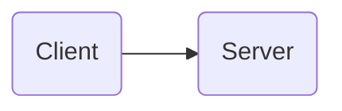
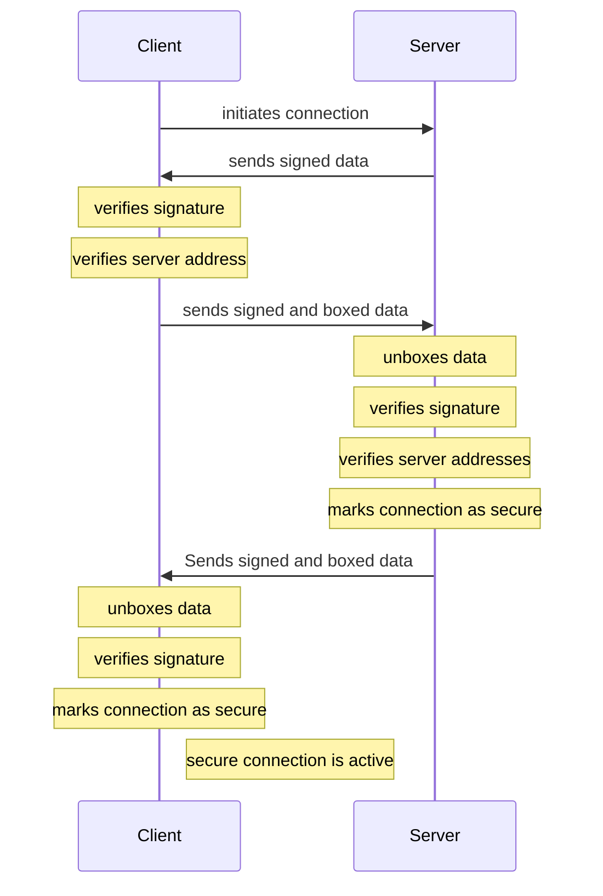
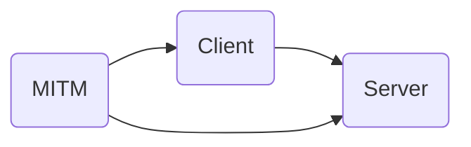
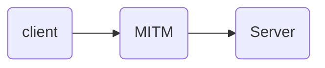
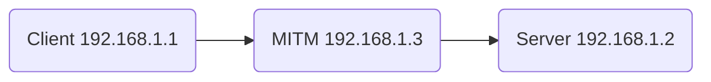

# Socket.io Connections

### Normal connections

The direction of the connection determines the client and server
- The peer initiating the connection is the client
- The peer receiving the connection request is the server
  - i.e. the connection is asymmetric
- This is also reflected in the socket.io configuration
  - One side uses the "server" package and one side uses the "client" package
- Two peers can both be a client and server for each other
  - This is inefficient in that it requires two connections but for now we're accepting that to simplify the security model
  - Eventually (maybe soon) we can allow using a single connection once it's been established as secure

**Device Info that is Exchanged**
- userId, deviceId, publicKey, publicBoxKey, addresses (IP or Domain)
- This is always signed
- In the case of the other user's public keys being known, this is boxed for those keys (can only be opened/read by the owner of those keys)

**Handshake Flow**
- Client initiates connection
- Server sends its signed device info to client
  - it doesn't know the client's public keys yet so it's not boxed
- Client verifies the server's address is what it's connected to
- Client verifies server signature
- Client signs and boxes it's information and sends it to the server
- Server unboxes and verifies the information
- Server verifies that the address the client is connecting to is its address

### Man in the Middle (MITM)

With the above, we can see that a man-in-the-middle can't initiate the process because it will be a client in both cases.

So it has to wait for the client to connect to it before it tries to impersonate itself as the server

For this configuration to be possible at all, the _Client_ needs to be tricked into initiating a request to Server but at the MITM's network address.  Let's assume this happens.

Then the MITM can just echo all requests and responses between the Client and Server until the authentication is complete.  After that the MITM can initiate requests to the server fully authenticated as the client.

Again, this only works if the client uses the wrong address to connect to the server. As long as the server is at a well known address and using https we're protected by the foundational security of the internet.

But if we want to use local connections or connections to unregistered IP addresses the MITM attack may still be possible.  Let's see what that looks like.

In this case the Server will include its address _and_ the Client's address in the signed "handshake data".  The client will include the server address that it is connecting to in its response which will be signed and also boxed. The MITM won't be able to alter the signed data (or even inspect the boxed data) since it doesn't have the appropriate keys.

The Server will see that the Client is sending data to `192.168.1.3` and the Client will see that the Server is reporting a different address than what it connected to.  Therefore they both can detect the MITM and react appropriately. So even in the case of servers not having known public keys, clients and servers can still detect and recover from MITM attacks.

When the server is operating at a well-known address (domain name or IP) and using https Socket.io connections should be completely secure.  This means we can use the existing internet security scheme to bootstrap up to Peers' asymmetric security scheme.

Without the internet's security we'll need to rely on other channels to securely communicate keys (in-person for example) but if the keys are already communicated then messages can always be boxed and signed, and therefore secure.  Signed and boxed data should be the default format for local and http (non-TSL) connections.

### Unsecure Connections with Known Keys

If all connections are considered unsecure by default we can still operate securely with a MITM by signing and boxing all data.  But this requires that both the client and server already know each other's public keys.  This requires trusted key registries.

`https://peers.app` (and eventually other agreed upon sources for peer groups) can act as predetermined key registries.  This will allow peer users to lookup keys for the user on the other side of the connection, then sign and box all data.  This will allow MITMs to actually facilitate proxy connections.  It will just require significantly more computation since all data needs to be signed and boxed and then unboxed and verified.  But, objectively, this is a critically important feature for Peers in that it allows communication in widely distributed, unstable, and semi-disconnected environments.

Even without an agreed upon registry, a peer can just ask many of its already-trusted peers if they know of this new peer and what the publicKey is

# Peer Groups as Key Registries

A `Group` is a foundational unit in Peers.  It is simply a list of approved users with one or more user having control over who is added or removed from the list.  Because users are explicitly added to the group, the group itself can act as a type of key registry for all users in the group.

This means that groups that rely completely on local networks can initially add a user via in-person key sharing.  This is inconvenient and inefficient but very secure.  After a group admin adds them though, all other peers will immediately have a secure source of the new user's public keys.

When a group operates this way and also requires that all communicates are signed and boxed, they will be operating in a very secure way, even if those communications are going across publicly viewable channels (e.g. twitter posts).

# WebRTC Connections

WebRTC connections are harder to work with because they require a signaling channel  but they are well suited for Peer connections using asymmetric key.

This is because all data sent through the signaling channel (which can be completely insecure) can be signed and boxed.  So by the time the connection is established both sides have already verified that the peer on the other side owns the keys they are using.  MITM attacks aren't feasible in this environment.

This, again, requires that both parties already know and trust the public keys are the correct ones for the user's id.  So key registry(s) or other trusted sources for keys are required.

# Trust

In all cases trust has to be placed somewhere
- In the case of socket.io connections
  - we're either using a public domain, in which case we're trusting that (for unknown peers)
  - or we're trusting a third-party source of userId-publicKey mapping
    - key registries
    - peer groups
    - manually input (in-person)
  - or we're blindly trusting the user/device on the other end of the connection
    - there are scenarios where this might be appropriate but these users and connections need to be well isolated from their trusted counterparts.

- In the case of WebRTC connections

- Trusting the security of the connection
- Trusting the source of the key
