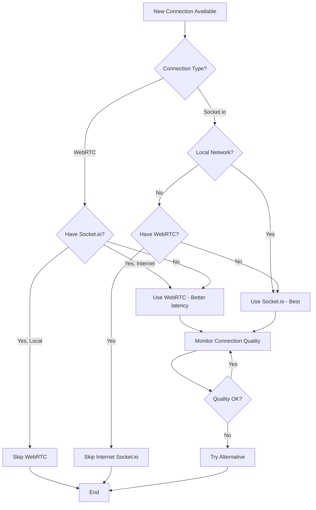
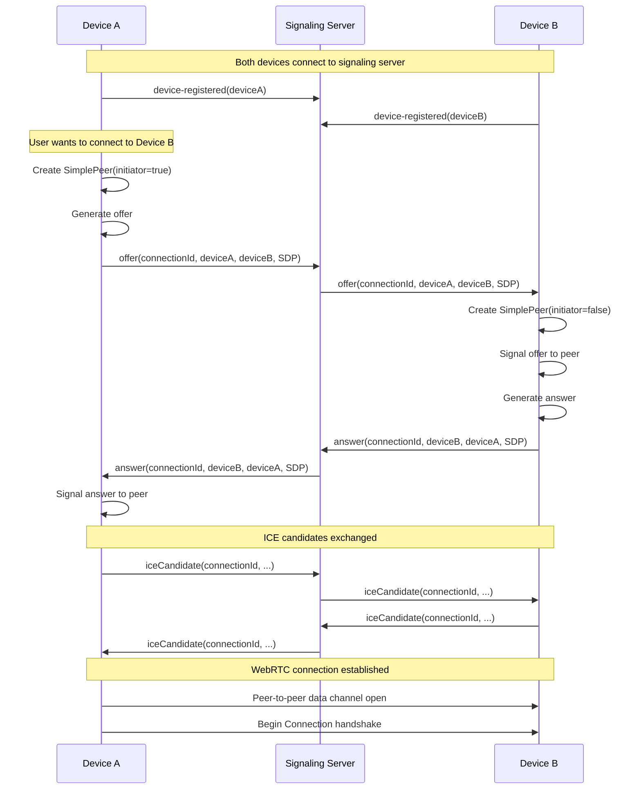

# WebRTC Implementation Proposal

## Executive Summary

This document proposes a minimal, incremental approach to completing WebRTC support in Peers. The goal is to enable direct peer-to-peer connections across the internet using WebRTC data channels, complementing the existing Socket.io local network connections.

**Key Benefits**:
- **NAT Traversal**: Connect devices behind NATs/firewalls without port forwarding
- **Peer-to-Peer**: Direct connections after signaling, reducing server dependency
- **Mobile-Friendly**: Works better on mobile devices that can't open listening ports
- **Built-in Encryption**: WebRTC data channels are encrypted by default

**Status**: The architecture is ready, ~60% of the code exists, needs completion and integration.

---

## Current State Analysis

### What Already Works ✅

1. **Transport Abstraction** (`ISocket` interface)
   - Complete and transport-agnostic
   - Works with Socket.io today
   - Ready for WebRTC

2. **Handshake Protocol** (`Connection` class)
   - Complete cryptographic handshake implementation
   - Works over any ISocket
   - Has `forceInsecure` flag specifically for WebRTC
   - Already handles trust verification

3. **Multi-Group Routing** (`ConnectionManager`)
   - Complete multi-group awareness
   - Routes any Connection to appropriate DeviceSync instances
   - Ready for WebRTC connections

4. **Data Transmission** (`PeerTx` class)
   - Handles object serialization (MessagePack)
   - Automatic compression (Brotli) for large data
   - Streaming support
   - **Location**: Currently in `peers-electron/src/server/connections/peer-tx.ts`
   - **Issue**: Uses Node.js `zlib` (not isomorphic)

5. **WebRTC Wrapper Skeleton** (`wrap-wrtc.ts`)
   - Basic ISocket implementation for SimplePeer
   - Uses PeerTx for data transmission
   - **Location**: `peers-electron/src/server/connections/wrap-wrtc.ts`
   - **Status**: ~40% complete

6. **Signaling Infrastructure** (peers-services)
   - Socket.io server ready
   - ICE server configuration (STUN + optional Twilio TURN)
   - `ISDIExchange` interface defined
   - **Location**: `peers-services/src/socket-server.ts`
   - **Status**: Signaling relay commented out (lines 143-167)

### What's Missing ❌

1. **wrap-wrtc.ts Completion**
   - ❌ Connection state tracking (`connected` always returns `true`)
   - ❌ SimplePeer event handlers (connect, close, error, data)
   - ❌ Callback garbage collection
   - ❌ Error handling and reconnection logic

2. **Signaling Client** (peers-electron)
   - ❌ Protocol for offer/answer/ICE candidate exchange
   - ❌ Integration with peers-services signaling server
   - ❌ Device availability tracking

3. **ConnectionManager Integration**
   - ❌ WebRTC connection scanner (parallel to Socket.io scanner)
   - ❌ Connection preference logic (local Socket.io vs internet WebRTC)
   - ❌ Automatic fallback between connection types

4. **Signaling Server** (peers-services)
   - ❌ Uncomment and test offer/answer/ICE relay
   - ❌ Device online/offline tracking
   - ❌ Message queuing for offline devices

5. **PeerTx Migration**
   - ❌ Move from peers-electron to peers-sdk
   - ❌ Replace `zlib` with `fflate` for isomorphic compression

---

## Minimal Implementation Plan

### Phase 1: Complete wrap-wrtc.ts (1-2 days)

**Goal**: Functional ISocket wrapper for SimplePeer

**Tasks**:
1. Add connection state tracking
   ```typescript
   let isConnected = false;
   peerWrtc.on('connect', () => {
     isConnected = true;
     // Notify Connection class
   });
   peerWrtc.on('close', () => {
     isConnected = false;
     // Cleanup
   });
   ```

2. Handle SimplePeer events
   ```typescript
   peerWrtc.on('error', (err) => {
     console.error('WebRTC error:', err);
     // Emit disconnect event for Connection class
   });

   peerWrtc.on('data', (data) => {
     // Already handled by PeerTx
   });
   ```

3. Add callback garbage collection
   ```typescript
   // After callback executed:
   delete callbacks[callbackId];

   // Add timeout for abandoned callbacks:
   setTimeout(() => delete callbacks[callbackId], 60000);
   ```

4. Return proper Connection instance
   ```typescript
   export function wrapWrtc(
     peerWrtc: SimplePeer.Instance,
     localDevice: Device,
     getTrustLevel: GetTrustLevel
   ): Connection {
     const socket: ISocket = { /* ... */ };
     return new Connection(socket, localDevice, undefined, getTrustLevel);
   }
   ```

**Testing**:
- Unit tests with mocked SimplePeer
- Manual testing in Electron renderer process (see [webrtc-testing.md](./webrtc-testing.md))

**Deliverable**: `wrap-wrtc.ts` that creates fully functional Connection instances from SimplePeer

---

### Phase 2: Implement Signaling Protocol (2-3 days)

**Goal**: Enable offer/answer/ICE exchange via peers-services

#### 2A: Enable Signaling Relay (peers-services)

**File**: `peers-services/src/socket-server.ts`

**Tasks**:
1. Uncomment signaling relay code (lines 143-167)
2. Add device online tracking
   ```typescript
   const onlineDevices = new Map<string, Socket>();

   socket.on('device-registered', (deviceId) => {
     onlineDevices.set(deviceId, socket);
   });

   socket.on('disconnect', () => {
     onlineDevices.delete(deviceId);
   });
   ```

3. Add message queuing for offline devices
   ```typescript
   const messageQueue = new Map<string, ISDIExchange[]>();

   if (!onlineDevices.has(toDeviceId)) {
     // Queue for later delivery
     if (!messageQueue.has(toDeviceId)) {
       messageQueue.set(toDeviceId, []);
     }
     messageQueue.get(toDeviceId).push(message);
   }
   ```

4. Deliver queued messages on reconnect
   ```typescript
   socket.on('device-registered', (deviceId) => {
     const queued = messageQueue.get(deviceId) || [];
     queued.forEach(msg => socket.emit(msg.type, msg));
     messageQueue.delete(deviceId);
   });
   ```

**Testing**:
- Unit tests for message routing
- Test with two clients exchanging offers/answers

#### 2B: Implement Signaling Client (peers-electron)

**New File**: `peers-electron/src/server/connections/webrtc-signaling.ts`

**Interface**:
```typescript
export interface IWebRTCSignaling {
  // Connect to signaling server
  connect(signalingServerUrl: string): Promise<void>;

  // Initiate connection to remote device
  initiateConnection(remoteDeviceId: string): Promise<SimplePeer.Instance>;

  // Handle incoming connection offers
  onIncomingConnection(handler: (peer: SimplePeer.Instance) => void): void;

  // Disconnect from signaling server
  disconnect(): void;
}
```

**Implementation**:
```typescript
export class WebRTCSignaling implements IWebRTCSignaling {
  private socket: Socket;
  private pendingPeers = new Map<string, SimplePeer.Instance>();
  private iceServers: RTCIceServer[];

  async connect(signalingServerUrl: string) {
    // Connect to peers-services
    this.socket = socketIO(signalingServerUrl);

    // Register device
    this.socket.emit('device-registered', this.localDeviceId);

    // Get ICE servers
    this.iceServers = await this.socket.emit('getIceServers');

    // Setup event handlers
    this.socket.on('offer', this.handleOffer.bind(this));
    this.socket.on('answer', this.handleAnswer.bind(this));
    this.socket.on('iceCandidate', this.handleIceCandidate.bind(this));
  }

  async initiateConnection(remoteDeviceId: string): Promise<SimplePeer.Instance> {
    // Create initiator peer
    const peer = new SimplePeer({
      initiator: true,
      trickle: true,  // Send ICE candidates as discovered
      config: { iceServers: this.iceServers }
    });

    // Store peer for answer handling
    const connectionId = newid();
    this.pendingPeers.set(connectionId, peer);

    // Send offer when generated
    peer.on('signal', (signal) => {
      if (signal.type === 'offer') {
        this.socket.emit('offer', {
          connectionId,
          fromDeviceId: this.localDeviceId,
          toDeviceId: remoteDeviceId,
          sdi: signal
        });
      } else if (signal.candidate) {
        this.socket.emit('iceCandidate', {
          connectionId,
          fromDeviceId: this.localDeviceId,
          toDeviceId: remoteDeviceId,
          iceCandidates: [signal]
        });
      }
    });

    return peer;
  }

  private async handleOffer(offer: ISDIExchange) {
    // Create answerer peer
    const peer = new SimplePeer({
      initiator: false,
      trickle: true,
      config: { iceServers: this.iceServers }
    });

    // Signal the offer
    peer.signal(offer.sdi);

    // Send answer when generated
    peer.on('signal', (signal) => {
      if (signal.type === 'answer') {
        this.socket.emit('answer', {
          connectionId: offer.connectionId,
          fromDeviceId: this.localDeviceId,
          toDeviceId: offer.fromDeviceId,
          sdi: signal
        });
      } else if (signal.candidate) {
        this.socket.emit('iceCandidate', {
          connectionId: offer.connectionId,
          fromDeviceId: this.localDeviceId,
          toDeviceId: offer.fromDeviceId,
          iceCandidates: [signal]
        });
      }
    });

    // Notify upper layer of incoming connection
    this.onIncomingHandler?.(peer);
  }

  private async handleAnswer(answer: ISDIExchange) {
    const peer = this.pendingPeers.get(answer.connectionId);
    if (peer) {
      peer.signal(answer.sdi);
      this.pendingPeers.delete(answer.connectionId);
    }
  }

  private async handleIceCandidate(ice: ISDIExchange) {
    const peer = this.pendingPeers.get(ice.connectionId);
    if (peer) {
      ice.iceCandidates.forEach(candidate => peer.signal(candidate));
    }
  }
}
```

**Testing**:
- Test offer/answer exchange between two Electron instances
- Test ICE candidate relay
- Test connection establishment success

**Deliverable**: Working signaling protocol between peers-electron and peers-services

---

### Phase 3: Integration with ConnectionManager (2-3 days)

**Goal**: Automatically establish WebRTC connections when devices are discovered

#### 3A: WebRTC Connection Scanner

**New File**: `peers-electron/src/server/connections/webrtc-client.ts`

**Interface**:
```typescript
export class WebRTCConnectionClient {
  constructor(
    private signaling: IWebRTCSignaling,
    private connectionManager: ConnectionManager,
    private localDevice: Device,
    private getTrustLevel: GetTrustLevel
  ) {}

  // Start scanning for available devices
  async start(): Promise<void>;

  // Stop scanning
  stop(): void;

  // Manually trigger connection to device
  connectToDevice(remoteDeviceId: string): Promise<void>;
}
```

**Implementation**:
```typescript
export class WebRTCConnectionClient {
  private scanInterval: NodeJS.Timer;
  private activeConnections = new Map<string, Connection>();

  async start() {
    // Connect to signaling server
    await this.signaling.connect(SIGNALING_SERVER_URL);

    // Handle incoming connections
    this.signaling.onIncomingConnection(async (peer) => {
      const connection = await this.createConnection(peer);
      if (connection) {
        this.connectionManager.addConnection(connection);
      }
    });

    // Periodically scan for devices
    this.scanInterval = setInterval(() => {
      this.scanForDevices();
    }, 60000); // Every minute

    // Initial scan
    await this.scanForDevices();
  }

  private async scanForDevices() {
    // Get list of trusted devices from database
    const devices = await this.getKnownDevices();

    // Try to connect to each device not already connected
    for (const device of devices) {
      if (!this.activeConnections.has(device.deviceId)) {
        await this.connectToDevice(device.deviceId);
      }
    }
  }

  async connectToDevice(remoteDeviceId: string) {
    try {
      // Initiate WebRTC connection
      const peer = await this.signaling.initiateConnection(remoteDeviceId);

      // Create Connection when connected
      peer.on('connect', async () => {
        const connection = await this.createConnection(peer);
        if (connection) {
          this.activeConnections.set(remoteDeviceId, connection);
          this.connectionManager.addConnection(connection);
        }
      });

      // Handle disconnect
      peer.on('close', () => {
        const connection = this.activeConnections.get(remoteDeviceId);
        if (connection) {
          this.connectionManager.removeConnection(connection);
          this.activeConnections.delete(remoteDeviceId);
        }
      });
    } catch (err) {
      console.error(`Failed to connect to ${remoteDeviceId}:`, err);
    }
  }

  private async createConnection(peer: SimplePeer.Instance): Promise<Connection | null> {
    // Wrap SimplePeer as ISocket
    const connection = wrapWrtc(peer, this.localDevice, this.getTrustLevel);

    // Don't need server addresses (not acting as server)
    // Connection will set forceInsecure=true for WebRTC

    // Do handshake
    try {
      await connection.doHandshake('webrtc://signaling');
      return connection;
    } catch (err) {
      console.error('WebRTC handshake failed:', err);
      peer.destroy();
      return null;
    }
  }
}
```

#### 3B: Integration in peers-init.ts

**File**: `peers-electron/src/server/peers-init.ts`

**Changes**:
```typescript
// After starting Socket.io connections:
const socketServer = await startConnectionsServer(/* ... */);
const socketClient = await startConnectionsClient(/* ... */);

// Add WebRTC connections:
const webrtcSignaling = new WebRTCSignaling(localDevice);
const webrtcClient = new WebRTCConnectionClient(
  webrtcSignaling,
  connectionManager,
  localDevice,
  getTrustLevel
);
await webrtcClient.start();
```

**Testing**:
- Test automatic connection establishment
- Test with devices on different networks (NAT traversal)
- Test handshake over WebRTC
- Test multi-group routing over WebRTC

**Deliverable**: Automatic WebRTC connections alongside Socket.io connections

---

### Phase 4: Connection Preference & Fallback (1-2 days)

**Goal**: Intelligently choose between Socket.io and WebRTC based on network conditions

**Enhancements to ConnectionManager**:

```typescript
export class ConnectionManager {
  // Track connection types
  private connectionTypes = new Map<Connection, 'socket.io' | 'webrtc'>();

  // Connection quality metrics
  private connectionMetrics = new Map<Connection, IConnectionMetrics>();

  addConnection(connection: Connection, type: 'socket.io' | 'webrtc') {
    // Prefer local Socket.io over internet WebRTC
    if (this.hasLocalSocketConnection(connection.remoteDeviceId)) {
      if (type === 'webrtc') {
        console.log('Already have local Socket.io, skipping WebRTC');
        connection.disconnect();
        return;
      }
    }

    // If we have WebRTC and new Socket.io is local, prefer Socket.io
    const existing = this.findConnection(connection.remoteDeviceId);
    if (existing && this.connectionTypes.get(existing) === 'webrtc') {
      if (type === 'socket.io' && this.isLocalConnection(connection)) {
        console.log('Replacing WebRTC with local Socket.io');
        this.removeConnection(existing);
      }
    }

    // Standard add logic
    this.connectionTypes.set(connection, type);
    // ... existing code ...
  }

  private isLocalConnection(connection: Connection): boolean {
    // Check if connection is to local network IP
    const address = connection.remoteDevice?.addresses?.[0];
    return address?.startsWith('192.168.') ||
           address?.startsWith('10.') ||
           address?.startsWith('localhost');
  }

  private hasLocalSocketConnection(deviceId: string): boolean {
    for (const [conn, type] of this.connectionTypes) {
      if (conn.remoteDeviceId === deviceId &&
          type === 'socket.io' &&
          this.isLocalConnection(conn)) {
        return true;
      }
    }
    return false;
  }
}
```

**Connection Preference Strategy**:



**Priority Order**:
1. **Local Socket.io** (192.168.x.x) - Fastest, most reliable
2. **WebRTC** - Good for internet, NAT traversal
3. **Internet Socket.io** (HTTPS) - Fallback if WebRTC fails
4. **Local HTTP Socket.io** - Last resort, sign+box all data

**Testing**:
- Test preference logic with both connection types available
- Test fallback when preferred connection fails
- Test automatic switching when network changes

**Deliverable**: Intelligent connection management with quality-based selection

---

## Signaling Protocol Design

### Message Types

```typescript
export interface ISDIExchange {
  connectionId: string;        // Unique ID for this connection attempt
  fromDeviceId: string;        // Source device
  toDeviceId: string;          // Destination device
  iceCandidates?: RTCIceCandidate[];  // ICE candidates
  sdi?: RTCSessionDescriptionInit;     // SDP offer or answer
}

// Client -> Server events:
- 'device-registered': deviceId
- 'offer': ISDIExchange
- 'answer': ISDIExchange
- 'iceCandidate': ISDIExchange

// Server -> Client events:
- 'offer': ISDIExchange
- 'answer': ISDIExchange
- 'iceCandidate': ISDIExchange
- 'device-online': deviceId
- 'device-offline': deviceId
```

### Signaling Flow



---

## Testing Strategy

### Unit Tests

1. **wrap-wrtc.ts**
   - Mock SimplePeer instances
   - Test ISocket interface compliance
   - Test state transitions (connecting, connected, disconnected)
   - Test error handling

2. **WebRTCSignaling**
   - Mock Socket.io connection
   - Test offer/answer/ICE exchange
   - Test device registration
   - Test offline device queuing

3. **WebRTCConnectionClient**
   - Mock signaling layer
   - Test connection establishment
   - Test handshake integration
   - Test ConnectionManager integration

### Integration Tests

1. **Local WebRTC** (same machine)
   - Two Electron instances
   - Renderer process testing (native WebRTC)
   - Verify data channel establishment
   - Verify handshake completion

2. **NAT Traversal** (different networks)
   - Two devices on different networks
   - Verify STUN server usage
   - Verify ICE candidate exchange
   - Verify connection establishment

3. **Multi-Group Sync**
   - Two devices with multiple shared groups
   - Verify single WebRTC connection routes to multiple DeviceSync instances
   - Verify data isolation between groups

### Manual Testing Scenarios

1. **Hybrid Connections**
   - Device A and B on same local network (Socket.io)
   - Device C on internet (WebRTC)
   - Verify all three sync correctly

2. **Network Transitions**
   - Start with Socket.io on local network
   - Disconnect from WiFi
   - Connect via mobile hotspot
   - Verify WebRTC takes over

3. **Firewall Scenarios**
   - Test with restrictive firewall rules
   - Test with UDP blocked (should fail gracefully)
   - Test with only TURN servers (no STUN)

4. **Connection Limits**
   - Connect to 30+ devices
   - Verify connection pooling
   - Verify least-preferred connection removal

---

## Migration Considerations

### PeerTx Migration to peers-sdk

**Current**: `peers-electron/src/server/connections/peer-tx.ts`
**Target**: `peers-sdk/src/device/peer-tx.ts`

**Required Changes**:
1. Replace `zlib` with `fflate`
   ```typescript
   // Before:
   import { brotliCompressSync, brotliDecompressSync } from 'zlib';

   // After:
   import { compressSync, decompressSync } from 'fflate';

   // Usage:
   const compressed = compressSync(new Uint8Array(buffer), { level: 6 });
   const decompressed = decompressSync(compressed);
   ```

2. Remove Node.js stream dependencies
   - Replace `Readable` stream with async iterators
   - Use browser-compatible APIs only

3. Update imports in wrap-wrtc.ts
   ```typescript
   // Before:
   import { PeerTx } from './peer-tx';

   // After:
   import { PeerTx } from 'peers-sdk/device/peer-tx';
   ```

**Testing**:
- Verify works in Node.js (Electron main process)
- Verify works in browser (Electron renderer)
- Verify works in React Native (future)

**Priority**: Can be done last, current location works for initial implementation

---

## Mobile Considerations (React Native)

WebRTC support in React Native requires different libraries:

**Current**: Uses `simple-peer` (Node.js/browser)
**Mobile**: Needs `react-native-webrtc`

**Strategy**:
1. Keep ISocket interface the same
2. Create `wrap-react-native-webrtc.ts` in peers-react-native
3. Implement similar signaling client
4. Use same peers-services signaling server

**Implementation** (future work):
```typescript
// peers-react-native/src/connections/wrap-react-native-webrtc.ts
import { RTCPeerConnection, RTCSessionDescription, RTCIceCandidate } from 'react-native-webrtc';

export function wrapReactNativeWebRTC(
  pc: RTCPeerConnection,
  localDevice: Device,
  getTrustLevel: GetTrustLevel
): Connection {
  // Similar to wrap-wrtc.ts but using react-native-webrtc APIs
  // ...
}
```

**Timeline**: Phase 5 (after desktop implementation complete)

---

## Security Considerations

### Trust Model

WebRTC connections follow the same trust model as Socket.io:
1. Handshake verifies cryptographic identity
2. Trust level checked before accepting connection
3. All RPC data can be signed+boxed if needed
4. Group membership verified before exposing sync RPCs

### Signaling Server Trust

**Threat**: Malicious signaling server could relay incorrect offers/answers

**Mitigation**:
- Handshake verifies device identity AFTER connection established
- Signaling server cannot impersonate devices (no access to secret keys)
- Failed handshake results in connection termination
- Multiple signaling servers can be used (decentralized discovery)

### ICE Candidate Leaking

**Threat**: ICE candidates reveal local IP addresses

**Mitigation**:
- Expected behavior - required for NAT traversal
- Only shared with devices user explicitly trusts
- Can configure to only use relay (TURN) servers if privacy critical

### TURN Server Security

**Threat**: TURN servers see all traffic if direct connection fails

**Mitigation**:
- WebRTC data channels are encrypted end-to-end
- TURN server cannot decrypt data
- Can self-host TURN servers for sensitive deployments

---

## Success Criteria

### Minimum Viable WebRTC (MVP)

- ✅ Two devices can establish WebRTC connection via signaling
- ✅ Connection handshake completes successfully
- ✅ ConnectionManager routes WebRTC connection to DeviceSync
- ✅ Data syncs correctly over WebRTC
- ✅ Works across different networks (NAT traversal)

### Phase 1 Complete

- ✅ wrap-wrtc.ts passes all unit tests
- ✅ Connection state accurately tracked
- ✅ Error handling tested
- ✅ Manual testing in Electron renderer successful

### Phase 2 Complete

- ✅ Signaling server relays offers/answers/ICE correctly
- ✅ Two Electron instances establish WebRTC via signaling
- ✅ Offline device message queuing works
- ✅ ICE candidates relay correctly

### Phase 3 Complete

- ✅ WebRTC connections automatically established
- ✅ Integration tests pass
- ✅ Multi-group sync works over WebRTC
- ✅ Handshake succeeds over WebRTC

### Phase 4 Complete

- ✅ Connection preference logic working
- ✅ Automatic fallback on connection failure
- ✅ Network transition handling
- ✅ Connection quality monitoring

---

## Timeline Estimate

| Phase | Duration | Deliverable |
|-------|----------|-------------|
| Phase 1 | 1-2 days | Complete wrap-wrtc.ts |
| Phase 2A | 1 day | Signaling relay (peers-services) |
| Phase 2B | 1-2 days | Signaling client (peers-electron) |
| Phase 3 | 2-3 days | ConnectionManager integration |
| Phase 4 | 1-2 days | Connection preference logic |
| **Total** | **6-10 days** | **Full WebRTC support** |

**Assumptions**:
- Single developer, full-time
- Includes testing and debugging
- Excludes PeerTx migration (can be done later)
- Excludes mobile support (Phase 5, future)

---

## Risk Mitigation

### Risk: SimplePeer compatibility issues

**Mitigation**:
- Use SimplePeer in renderer process (native WebRTC)
- Extensive testing before main process integration
- Fallback to Socket.io if WebRTC fails

### Risk: STUN servers unreliable

**Mitigation**:
- Configure multiple STUN servers
- Add optional Twilio TURN support
- Allow self-hosted TURN configuration

### Risk: NAT traversal fails

**Mitigation**:
- Fallback to Socket.io connections
- Document TURN server setup
- Add diagnostic tools for NAT issues

### Risk: Connection management complexity

**Mitigation**:
- Incremental implementation (phases)
- Comprehensive testing at each phase
- Clear preference logic documented

---

## Future Enhancements (Post-MVP)

1. **PeerTx Migration**
   - Move to peers-sdk with fflate
   - Better compression strategies
   - Streaming optimizations

2. **Mobile Support**
   - React Native WebRTC implementation
   - Mobile-specific optimizations
   - Battery usage optimization

3. **Connection Analytics**
   - Latency tracking
   - Bandwidth usage
   - Connection success rates
   - Network quality metrics

4. **Advanced NAT Traversal**
   - Self-hosted TURN servers
   - Automatic TURN fallback
   - Symmetric NAT handling

5. **Multiple Signaling Servers**
   - Decentralized discovery
   - Fallback signaling servers
   - DHT-based peer discovery

6. **Bluetooth Connections**
   - Another ISocket implementation
   - Local device sync without internet
   - Mobile-to-mobile connections

---

## Conclusion

WebRTC support is a natural extension of the existing Peers architecture. The layered design means most of the infrastructure is already in place. The work required is primarily:

1. **Complete wrap-wrtc.ts** (straightforward, well-scoped)
2. **Implement signaling** (standard WebRTC pattern)
3. **Integrate with ConnectionManager** (leverage existing multi-group routing)
4. **Add connection preferences** (optimization, not critical path)

The minimal implementation can be completed in 6-10 days and will enable Peers to work seamlessly across the internet, not just local networks.

**Recommended Approach**: Implement incrementally, test at each phase, deploy Phase 1-3 before optimizing with Phase 4.

---

## References

- [WebRTC API Documentation](https://developer.mozilla.org/en-US/docs/Web/API/WebRTC_API)
- [SimplePeer Library](https://github.com/feross/simple-peer)
- [Connections Architecture](./architecture.md)
- [Socket.io Connections](./socket-io-connections.md)
- [WebRTC Testing Guide](./webrtc-testing.md)

**Code Locations**:
- Wrap WRTC: `peers-electron/src/server/connections/wrap-wrtc.ts`
- PeerTx: `peers-electron/src/server/connections/peer-tx.ts`
- Signaling Server: `peers-services/src/socket-server.ts`
- Connection Manager: `peers-device/src/connection-manager/connection-manager.ts`
- Connection: `peers-sdk/src/device/connection.ts`
