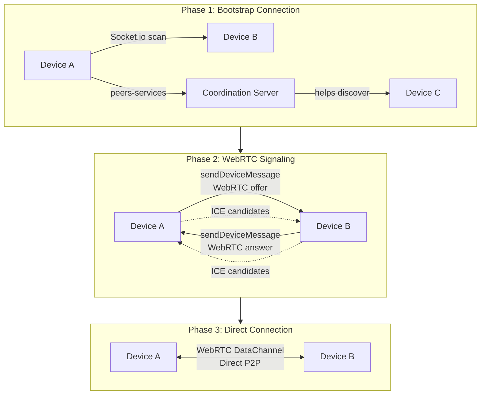
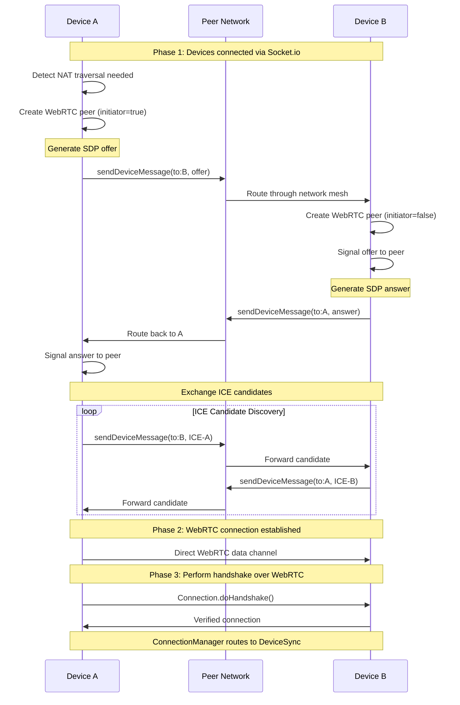
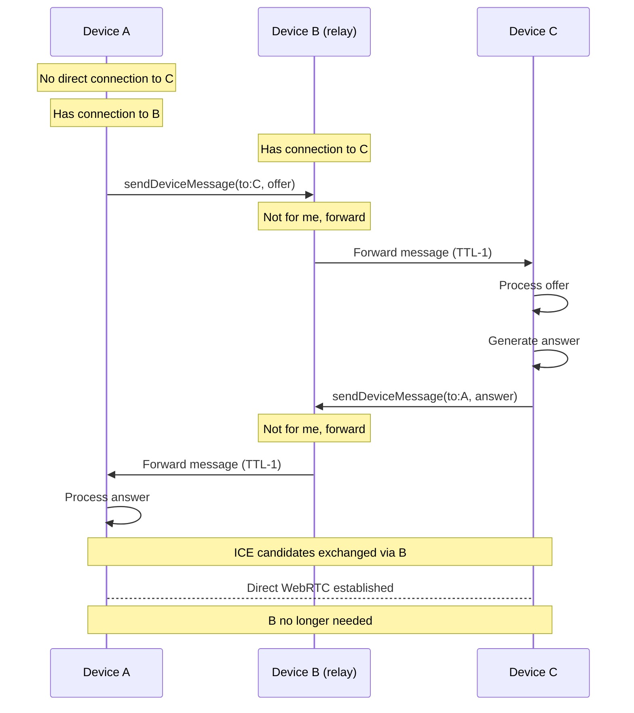

# WebRTC Signaling via sendDeviceMessage

This document describes how Peers establishes WebRTC connections using the existing peer network as a decentralized signaling channel.

## Overview

Peers uses a **two-phase connection strategy**:

1. **Bootstrap Phase**: Establish initial connection via Socket.io (local network scan or peers-services)
2. **Upgrade Phase**: Use existing connections to signal and establish direct WebRTC connections

**Key Innovation**: The `sendDeviceMessage` RPC method serves as a **decentralized signaling channel**, eliminating the need for a central WebRTC signaling server.

---

## Why sendDeviceMessage as Signaling?

Traditional WebRTC requires a signaling server to exchange SDP offers/answers and ICE candidates. Peers already has a peer-to-peer messaging system (`sendDeviceMessage`) that can route messages through the network mesh.

**Benefits:**
- **No single point of failure** - Any connected peer can relay signaling
- **Multi-hop signaling** - Device A can reach Device C through Device B
- **Decentralized** - No central signaling server required
- **Bootstraps from any connection** - Works over Socket.io, HTTPS, or existing WebRTC
- **Already secure** - Messages are cryptographically signed

---

## Architecture



---

## sendDeviceMessage Protocol

### Message Structure

```typescript
interface IDeviceMessage {
  deviceMessageId: string;    // Unique message ID
  fromDeviceId: string;       // Sender device
  toDeviceId: string;         // Target device
  dataContextId: string;      // User or group context
  ttl: number;                // Time-to-live (hops)
  payload: any;               // WebRTC signaling data goes here
  signature: string;          // Cryptographic signature
  hops: string[];            // Devices that forwarded this message
}
```

**Location**: `peers-sdk/src/types/peer-device.ts:14-23`

### Message Routing

Messages are routed through the peer network using **intelligent path finding** with network topology awareness:

**Network Topology Caching:**
- Each device maintains a `networkCache` with information about devices up to 2 hops away
- Cache contains connections of connections (devices reachable via intermediate peers)
- Enables efficient path finding for targets within 3 hops

**Routing Algorithm:**
1. **Direct delivery**: If sender has direct connection to target, deliver immediately
2. **1-hop delivery**: If target is in network cache (connected to one of sender's peers), route through that peer
3. **Multi-hop routing**: If target not within 2-hop radius:
   - Select connected peers with highest count of unique devices (devices sender doesn't know)
   - Avoid peers that won't expose message to new devices
   - Forward to most promising peers only (not broadcast/flood)
4. **TTL limit**: Message expires after maximum hops to prevent infinite loops

**Key Benefits:**
- **Efficient**: Targeted forwarding, not flooding
- **Scalable**: Minimal message duplication
- **High delivery rate**: Smart peer selection maximizes reach
- **Network-aware**: Leverages topology knowledge for optimal paths

**Implementation**: `peers-device/src/connection-manager/connection-manager.ts:309-469`

---

## WebRTC Signaling Flow

### Complete Connection Sequence



---

## WebRTC Signaling Payload Format

### Offer Message

```typescript
{
  deviceMessageId: "msg-123",
  fromDeviceId: "device-a",
  toDeviceId: "device-b",
  dataContextId: "user-context-id",
  ttl: 5,
  payload: {
    type: 'webrtc-offer',
    connectionId: 'conn-abc',
    sdp: {
      type: 'offer',
      sdp: 'v=0\r\no=- 123...'
    }
  },
  signature: "0x...",
  hops: []
}
```

### Answer Message

```typescript
{
  deviceMessageId: "msg-124",
  fromDeviceId: "device-b",
  toDeviceId: "device-a",
  dataContextId: "user-context-id",
  ttl: 5,
  payload: {
    type: 'webrtc-answer',
    connectionId: 'conn-abc',
    sdp: {
      type: 'answer',
      sdp: 'v=0\r\na=...'
    }
  },
  signature: "0x...",
  hops: ["device-x"]
}
```

### ICE Candidate Message

```typescript
{
  deviceMessageId: "msg-125",
  fromDeviceId: "device-a",
  toDeviceId: "device-b",
  dataContextId: "user-context-id",
  ttl: 5,
  payload: {
    type: 'webrtc-ice',
    connectionId: 'conn-abc',
    candidate: {
      candidate: 'candidate:1 1 UDP 2130706431 192.168.1.100 54321 typ host',
      sdpMLineIndex: 0,
      sdpMid: 'data'
    }
  },
  signature: "0x...",
  hops: []
}
```

---

## Implementation Requirements

### 1. WebRTC Signaling Handler

Create handler for WebRTC signaling messages in `sendDeviceMessage`:

**Location**: `peers-device/src/sync-device.ts:665`

```typescript
public async sendDeviceMessage(message: IDeviceMessage): Promise<any> {
  // Existing handlers...

  // Add WebRTC signaling handlers
  if (message.payload?.type === 'webrtc-offer') {
    return this.handleWebRTCOffer(message);
  }
  if (message.payload?.type === 'webrtc-answer') {
    return this.handleWebRTCAnswer(message);
  }
  if (message.payload?.type === 'webrtc-ice') {
    return this.handleWebRTCICE(message);
  }

  return { statusCode: 404, statusMessage: "No handler for message" };
}
```

### 2. WebRTC Connection Manager

Create a WebRTC connection manager that:
- Detects when WebRTC upgrade is beneficial (NAT traversal needed)
- Creates SimplePeer instances
- Sends offers/answers via `sendDeviceMessage`
- Handles incoming signaling messages
- Wraps connected peer as `Connection` via `wrapWrtc`
- Adds to `ConnectionManager`

### 3. Message Handlers

Implement handlers for each message type:

```typescript
async handleWebRTCOffer(message: IDeviceMessage) {
  const { connectionId, sdp } = message.payload;

  // Create answerer peer
  const peer = new SimplePeer({ initiator: false, trickle: true });
  peer.signal(sdp);

  // When answer generated, send back
  peer.on('signal', (answer) => {
    this.sendDeviceMessage({
      deviceMessageId: newid(),
      fromDeviceId: this.deviceId,
      toDeviceId: message.fromDeviceId,
      dataContextId: message.dataContextId,
      ttl: 5,
      payload: { type: 'webrtc-answer', connectionId, sdp: answer },
      signature: this.signMessage(...),
      hops: []
    });
  });

  // When connected, wrap and add to ConnectionManager
  peer.on('connect', () => {
    const connection = wrapWrtc(peer, this.localDevice, this.getTrustLevel);
    connection.doHandshake('webrtc://peer');
    this.connectionManager.addConnection(connection);
  });
}
```

---

## Multi-Hop Signaling Example

Device A wants to connect to Device C, but only has connection to Device B:



---

## Security Considerations

### Trust Model

WebRTC signaling follows the same trust model as all peer communication:

1. **Messages are signed** - `signature` field verified against sender's public key
2. **Handshake after connection** - WebRTC data channel established, then cryptographic handshake
3. **Trust level checked** - Connection rejected if sender not trusted
4. **Group membership verified** - Only share group data with authorized members

### Signaling Security

**Q: Can relay peer (Device B) tamper with signaling messages?**

**A: No.** Messages are cryptographically signed. Device B can:
- ✅ Forward messages unchanged (expected behavior)
- ✅ Drop messages (Byzantine fault - detected by timeout)
- ❌ Modify messages (signature verification fails)
- ❌ Impersonate sender (no access to secret key)

**Q: Can relay peer see signaling data?**

**A: Yes.** SDP offers/answers are not encrypted (only signed). This is acceptable because:
- Signaling only contains network information (IPs, ports)
- WebRTC data channel is **always encrypted** (DTLS-SRTP)
- Handshake over WebRTC verifies identity
- Failed handshake → connection terminated

### WebRTC Encryption

WebRTC data channels provide **built-in end-to-end encryption**:
- DTLS for channel encryption
- SRTP for media streams
- No additional encryption needed
- Set `Connection.forceInsecure = true` to skip double-encryption

---

## Implementation Status

**Ready to use:**
- ✅ `sendDeviceMessage` RPC infrastructure
- ✅ Multi-hop routing with TTL flooding
- ✅ Message signing and verification
- ✅ `wrapWrtc` skeleton for SimplePeer → Connection
- ✅ `Connection` handshake protocol
- ✅ `ConnectionManager` multi-group routing

**Needs implementation:**
- ❌ WebRTC signaling message handlers
- ❌ WebRTC connection lifecycle management
- ❌ Offer/answer/ICE exchange logic
- ❌ Integration with ConnectionManager
- ❌ Connection upgrade decision logic

---

## Testing Strategy

### Unit Tests
1. Test signaling message handlers (mock `sendDeviceMessage`)
2. Test WebRTC connection lifecycle
3. Test multi-hop message routing

### Integration Tests
1. Two devices on same local network
2. Two devices across NAT (requires STUN)
3. Three devices with relay signaling
4. WebRTC handshake completion
5. Multi-group sync over WebRTC

### Manual Testing
1. Disconnect Socket.io → verify WebRTC upgrade
2. Change networks → verify reconnection
3. Firewall scenarios → verify STUN/TURN fallback

---

## Code References

| Component | Location |
|-----------|----------|
| IDeviceMessage | `peers-sdk/src/types/peer-device.ts:14-23` |
| sendDeviceMessage RPC | `peers-device/src/connection-manager/connection-manager.ts:142` |
| Message routing | `peers-device/src/connection-manager/connection-manager.ts:309-469` |
| DeviceSync handler | `peers-device/src/sync-device.ts:665` |
| WebRTC wrapper | `peers-electron/src/server/connections/wrap-wrtc.ts` |
| SimplePeer helper | `peers-electron/src/server/connections/webrtc.ts` |

---

## See Also

- [Connection Architecture](./architecture.md) - Complete layer architecture
- [WebRTC Testing](./webrtc-testing.md) - Testing in Electron
- [Socket.io Connections](./socket-io-connections.md) - Bootstrap connection security
