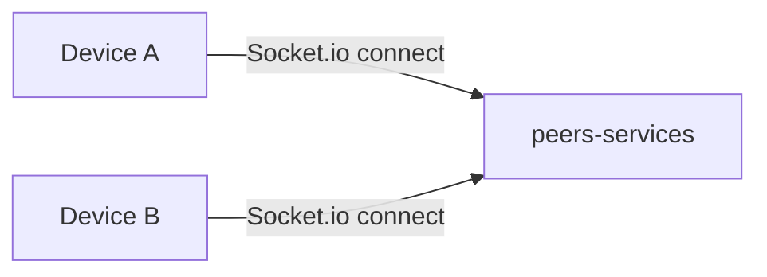
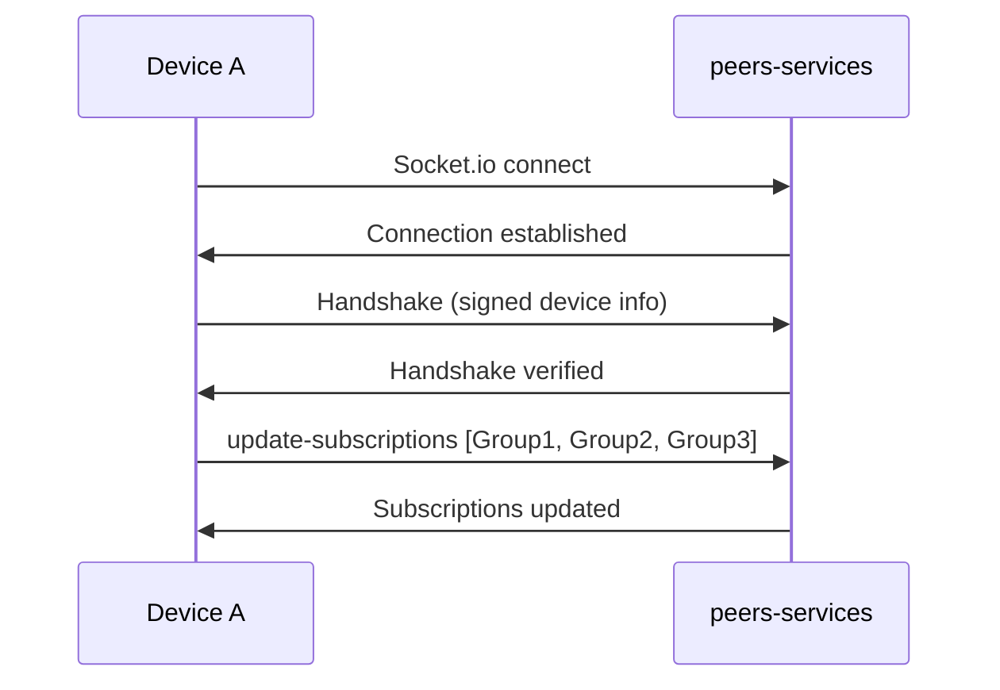
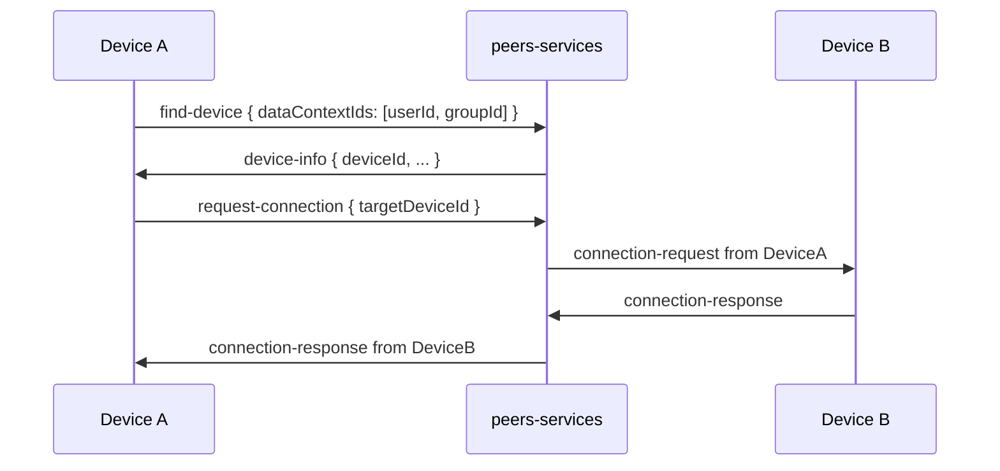

# WebRTC Signaling via peers-services

```mermaid
flowchart LR
    Server[peers-services]
    DeviceA[Device A]
    DeviceB[Device B]

    DeviceA -->|Socket.io connect| Server
    DeviceB -->|Socket.io connect| Server
```

## Device Connection and Subscription
 

```mermaid
sequenceDiagram
    participant DeviceA as Device A
    participant Server as peers-services

    DeviceA->>Server: Socket.io connect
    Server->>DeviceA: Connection established

    DeviceA->>Server: Handshake (signed device info)
    Server->>DeviceA: Handshake verified

    DeviceA->>Server: update-subscriptions [Group1, Group2, Group3]
    Server->>DeviceA: Subscriptions updated
```

## Device Connection Request

```mermaid
sequenceDiagram
    participant DeviceA as Device A
    participant Server as peers-services
    participant DeviceB as Device B

    DeviceA->>Server: find-device { dataContextIds: [userId, groupId] }
    Server->>DeviceA: device-info { deviceId, ... }

    DeviceA->>Server: request-connection { targetDeviceId }
    Server->>DeviceB: connection-request from DeviceA

    DeviceB->>Server: connection-response
    Server->>DeviceA: connection-response from DeviceB
```
