# Peers Device Architecture

## Device-User-Group Relationships

```mermaid
graph TD
    Group[👥 Group]
    
    User1[👤 User 1]
    User2[👤 User 2]
    UserN[👤 User N]
    
    User1Device1[📱 User 1 - Phone]
    User1Device2[💻 User 1 - Laptop]
    User1DeviceN[⌚ User 1 - Watch]
    
    User2Device1[📱 User 2 - Phone]
    User2Device2[🖥️ User 2 - Desktop]
    User2DeviceM[📟 User 2 - Tablet]
    
    UserNDevice1[📱 User N - Phone]
    UserNDevice2[💻 User N - Laptop]
    
    %% Group to User relationships (1:many)
    Group -->|contains| User1
    Group -->|contains| User2
    Group -->|contains| UserN
    
    %% User to Device relationships (1:many)
    User1 -->|owns| User1Device1
    User1 -->|owns| User1Device2
    User1 -->|owns| User1DeviceN
    
    User2 -->|owns| User2Device1
    User2 -->|owns| User2Device2
    User2 -->|owns| User2DeviceM
    
    UserN -->|owns| UserNDevice1
    UserN -->|owns| UserNDevice2
    
    %% Styling
    classDef groupClass fill:#e8f5e8
    classDef userClass fill:#e1f5fe
    classDef deviceClass fill:#f3e5f5
    
    class Group groupClass
    class User1,User2,UserN userClass
    class User1Device1,User1Device2,User1DeviceN,User2Device1,User2Device2,User2DeviceM,UserNDevice1,UserNDevice2 deviceClass
```

## Key Relationships

### Group → Users (1:N)
- Each group can contain multiple users
- Users collaborate within the group context
- Group membership determines access to shared data

### User → Devices (1:N)
- Each user can own multiple devices
- Devices provide different interfaces to the same user data
- All devices belonging to a user have access to the user's groups

## Device Types & Use Cases

### Common Device Types
- **📱 Mobile Phones**: Primary communication device, always connected
- **💻 Laptops**: Full-featured interface, development and productivity
- **🖥️ Desktops**: Stationary workstation, high-performance tasks
- **📟 Tablets**: Portable consumption and light productivity
- **⌚ Wearables**: Quick notifications and basic interactions

### Device Synchronization
- All devices belonging to a user sync data through the group databases
- Device-specific settings and preferences may be stored locally
- Cross-device continuity allows seamless switching between devices

## Architecture Benefits

### Scalability
- Groups can grow by adding more users
- Users can add more devices without affecting group structure
- Each relationship scales independently

### Flexibility
- Users can participate in multiple groups with the same devices
- New device types can be added without changing core architecture
- Different devices can have specialized interfaces while sharing data