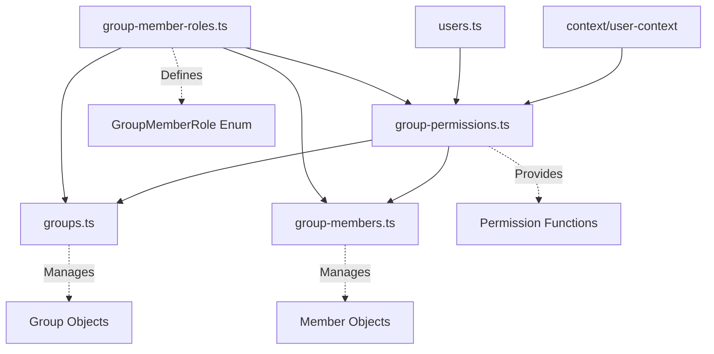
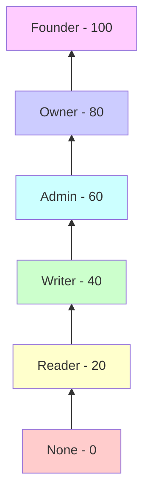
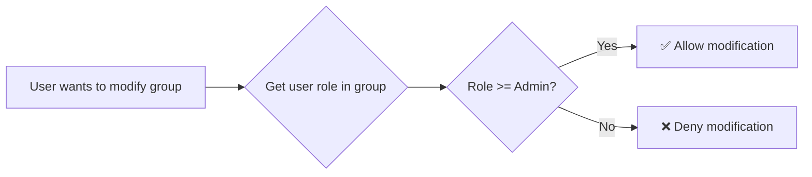
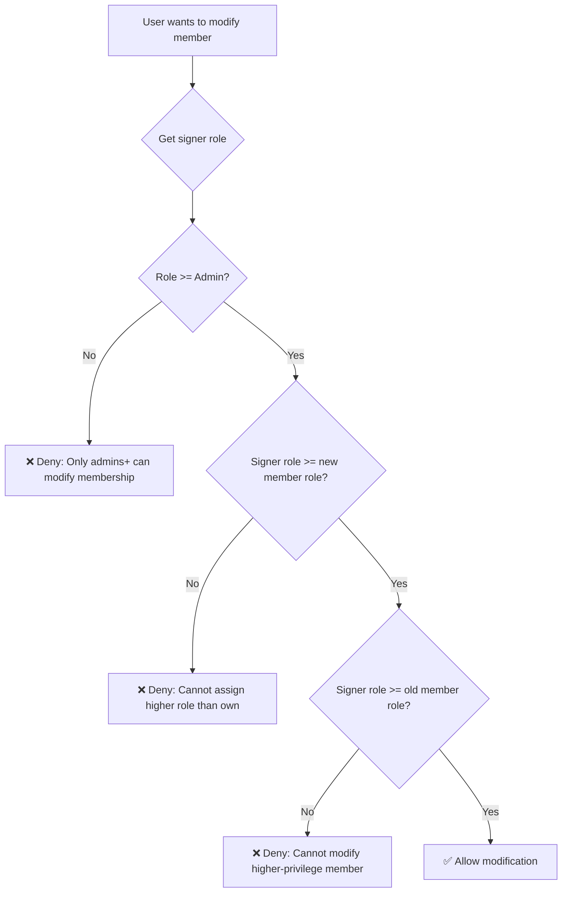
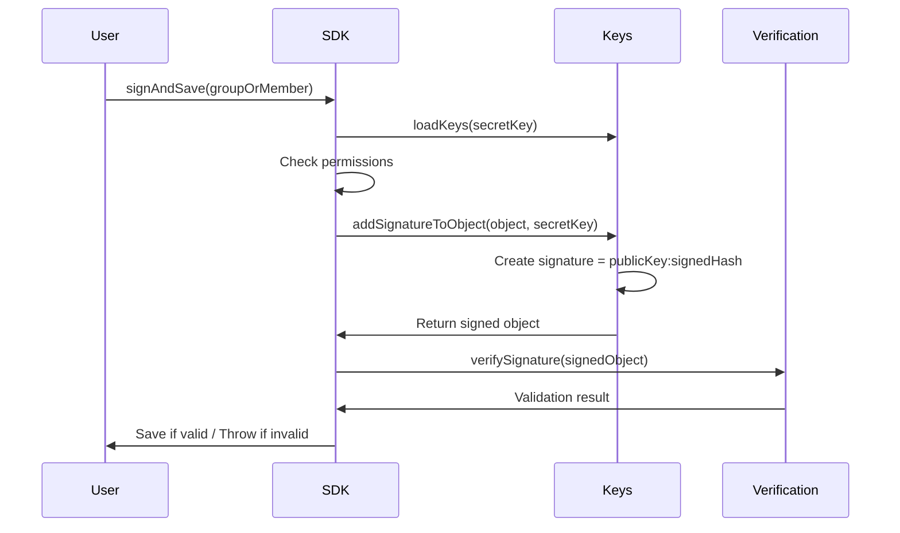
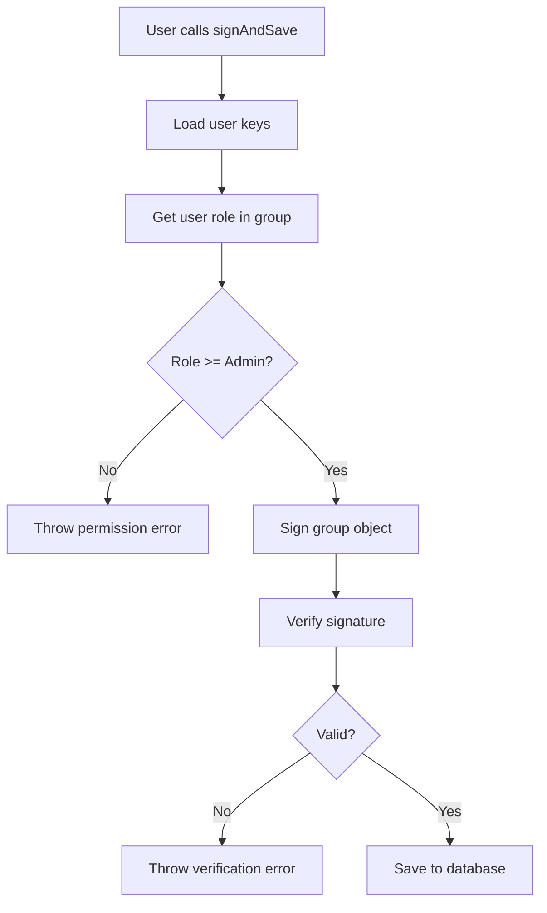
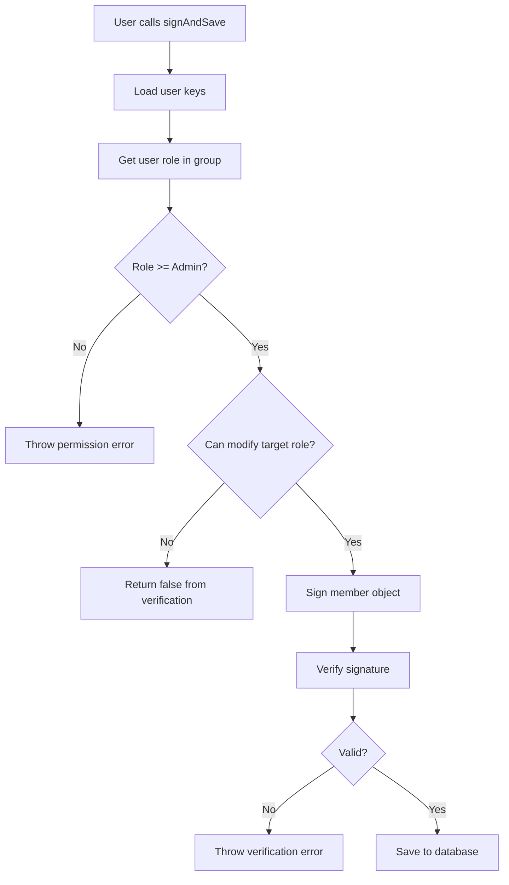

# Groups and Members Authentication System

This document describes the cryptographic signature-based authentication system for groups and group members in the Peers SDK.

## Overview

The Groups and Members system provides a decentralized, cryptographically secure way to manage group permissions and membership. It uses digital signatures to ensure that only authorized users can modify group settings and membership.

## Architecture



### File Structure

- **`group-member-roles.ts`**: Defines the role hierarchy enum
- **`group-permissions.ts`**: Core authentication and permission logic
- **`groups.ts`**: Group table definition and ORM integration
- **`group-members.ts`**: Group member table definition and ORM integration

## Role Hierarchy



### Role Permissions

| Role | Value | Description | Can Modify Group | Can Modify Members |
|------|-------|-------------|-----------------|-------------------|
| **None** | 0 | Explicitly blocked user | ❌ | ❌ |
| **Reader** | 20 | Read-only access | ❌ | ❌ |
| **Writer** | 40 | Can contribute content | ❌ | ❌ |
| **Admin** | 60 | Can manage members | ✅ | ✅ (up to Admin level) |
| **Owner** | 80 | Full group control | ✅ | ✅ (up to Owner level) |
| **Founder** | 100 | Group creator | ✅ | ✅ (all levels) |

## Permission Matrix

### Group Modification
Only **Admin** level and above can modify group properties.



### Member Modification



### Permission Examples

| Signer Role | Target Role | Operation | Result |
|-------------|-------------|-----------|---------|
| Admin (60) | Writer (40) | Promote to Admin (60) | ✅ Allowed |
| Admin (60) | Admin (60) | Demote to Writer (40) | ✅ Allowed |
| Admin (60) | Reader (20) | Promote to Owner (80) | ❌ Denied |
| Admin (60) | Owner (80) | Demote to Admin (60) | ❌ Denied |
| Owner (80) | Admin (60) | Promote to Owner (80) | ✅ Allowed |
| Owner (80) | Owner (80) | Demote to Writer (40) | ✅ Allowed |

## Cryptographic Security

### Signature Process



### Signature Format

Objects are signed with an embedded signature in the format:
```
signature: "publicKey:digitalSignature"
```

Where:
- `publicKey`: Base64-encoded public key of the signer
- `digitalSignature`: Base64-encoded signature of the object (excluding the signature field)

### Verification Process

1. **Extract public key** from signature
2. **Look up user** by public key across data contexts
3. **Determine role** of user in the group
4. **Validate permissions** based on role hierarchy
5. **Verify cryptographic signature** using TweetNaCl

## Data Flow

### Group Creation/Modification



### Member Management



## API Usage

### Setting Up Authentication

```typescript
import { Groups, GroupMembers } from 'peers-sdk';

// Set secret key for signing operations
Groups().setSecretKey(userSecretKey);
GroupMembers().setSecretKey(userSecretKey);

// Or bypass for UI/client operations
Groups().setSecretKey('passthrough');
```

### Group Operations

```typescript
// Create/update a group (requires Admin+ role)
const group: IGroup = {
  groupId: 'group-123',
  name: 'My Group',
  description: 'A test group',
  publicRole: GroupMemberRole.Reader,
  signature: ''
};

try {
  const savedGroup = await Groups().signAndSave(group);
  console.log('Group saved successfully');
} catch (error) {
  console.error('Permission denied:', error.message);
}
```

### Member Operations

```typescript
// Add/update a member (requires Admin+ role)
const member: IGroupMember = {
  groupMemberId: 'member-456',
  groupId: 'group-123',
  userId: 'user-789',
  role: GroupMemberRole.Writer,
  signature: ''
};

try {
  const savedMember = await GroupMembers().signAndSave(member);
  console.log('Member saved successfully');
} catch (error) {
  console.error('Permission denied:', error.message);
}
```

### Role Checking

```typescript
import { getUserRole, getUserRoleFromPublicKey } from 'peers-sdk';

// Check role by user ID
const role = await getUserRole('group-123', 'user-789');

// Check role by public key
const roleByKey = await getUserRoleFromPublicKey('group-123', publicKey);

if (role >= GroupMemberRole.Admin) {
  console.log('User can manage group');
}
```

## Security Considerations

### Best Practices

1. **Key Management**: Store secret keys securely, never in plaintext
2. **Permission Validation**: Always use `signAndSave()` instead of bypassing with `save()`
3. **Role Assignment**: Follow principle of least privilege
4. **Signature Verification**: Never accept objects without valid signatures in production

### Threat Model Protection

- ✅ **Unauthorized Access**: Cryptographic signatures prevent data tampering
- ✅ **Privilege Escalation**: Role hierarchy prevents users from granting themselves higher permissions
- ✅ **Replay Attacks**: Each signature is tied to specific object content
- ✅ **Man-in-the-Middle**: Digital signatures ensure data integrity

### Limitations

- **Key Compromise**: If a user's secret key is compromised, their permissions can be misused until the key is revoked
- **Founder Supremacy**: Founder role has absolute power - choose carefully
- **Context Dependencies**: Role lookups require access to user and member data contexts

## Testing

The system includes comprehensive tests covering:

- Basic signature functionality
- Permission validation scenarios  
- Role assignment rules
- Signature tampering detection
- Edge cases and error conditions

Run tests with:
```bash
npm test -- --testPathPattern="groups.test|group-members.test"
```

## Migration Notes

When upgrading from previous versions:

1. **Schema Changes**: Group objects no longer contain role-specific public keys
2. **Permission Model**: Switch from hardcoded keys to dynamic user role lookup  
3. **Circular Dependencies**: Import from `group-member-roles.ts` for the enum
4. **Testing**: Update tests to use new simplified group schema

## Troubleshooting

### Common Errors

**"Group signature verification failed"**
- Check that the user has Admin+ role in the group
- Ensure the secret key matches the user's public key
- Verify the group exists in the expected data context

**"Group member signature verification failed"**
- Confirm the user can modify the target role level
- Check that the old member role isn't higher than signer role
- Validate the group ID matches between contexts

### Debug Tips

1. Enable verbose logging to trace permission checks
2. Use `verifyObjectWithSignature()` to test signature validity
3. Check data contexts - users may exist in different contexts
4. Verify enum values match expected role hierarchy