# Peer Device Group Architecture

## Overview

With the new DataContext architecture enabling group isolation, we now need to extend the peer-device layer to handle group-specific connections and data syncing. This document outlines the **ConnectionManager** and **DeviceSync** architecture that treats all contexts (including user data context) as groups uniformly.

## Current Problem

The existing `PeerDevice` class only works with a single `changeTrackingTable` and `tableFactory`, making it unaware of multiple data contexts. When users belong to multiple groups (user + team + project contexts), we need separate peer device instances for each context to maintain data isolation while sharing physical connections between them.

## New Architecture: ConnectionManager

### Multi-Group Architecture with ConnectionManager

```mermaid
graph TB
    subgraph "User Context Layer"
        UserContext["UserContext<br/><br/>- userDataContext<br/>- groupDataContexts: Map"]
        UserDC["UserDataContext<br/>(User Group)<br/>tableFactory"]
        TeamDC["TeamDataContext<br/>(Team Alpha)<br/>tableFactory"]
        ProjectDC["ProjectDataContext<br/>(Project Beta)<br/>tableFactory"]
        
        UserContext --> UserDC
        UserContext --> TeamDC
        UserContext --> ProjectDC
    end
    
    subgraph "Connection Management Layer"
        PCM["ConnectionManager<br/><br/>addConnection(remoteDevice)<br/>- Gets remote groupIds<br/>- Finds shared groups<br/>- Routes to DeviceSyncs<br/>- Manages physical connections"]
    end
    
    subgraph "Group Device Layer"
        UserPGD["DeviceSync<br/>(User Group)<br/><br/>- Uses UserDataContext<br/>- Has own ChangeTrackingTable<br/>- Syncs user data"]
        TeamPGD["DeviceSync<br/>(Team Alpha)<br/><br/>- Uses TeamDataContext<br/>- Has own ChangeTrackingTable<br/>- Syncs team data"]
        ProjectPGD["DeviceSync<br/>(Project Beta)<br/><br/>- Uses ProjectDataContext<br/>- Has own ChangeTrackingTable<br/>- Syncs project data"]
    end
    
    subgraph "Remote Devices"
        Remote1["Remote Device 1<br/>(Same User)<br/>Groups: [user]"]
        Remote2["Remote Device 2<br/>(Different User)<br/>Groups: [team, project]"]
        Remote3["Remote Device 3<br/>(Different User)<br/>Groups: [team]"]
    end
    
    %% UserContext creates ConnectionManager
    UserContext -->|"creates and manages"| PCM
    
    %% ConnectionManager creates DeviceSyncs for each DataContext
    PCM -->|"creates with UserDataContext"| UserPGD
    PCM -->|"creates with TeamDataContext"| TeamPGD
    PCM -->|"creates with ProjectDataContext"| ProjectPGD
    
    %% Connection flow: Remote devices connect to PCM
    Remote1 -->|"addConnection()"| PCM
    Remote2 -->|"addConnection()"| PCM
    Remote3 -->|"addConnection()"| PCM
    
    %% PCM routes to appropriate DeviceSyncs based on shared groups
    PCM -->|"Route: shared groups [user]"| UserPGD
    PCM -->|"Route: shared groups [team, project]"| TeamPGD
    PCM -->|"Route: shared groups [team, project]"| ProjectPGD
    PCM -->|"Route: shared groups [team]"| TeamPGD
    
    %% Visual connection examples
    Remote1 -.->|"Ends up connected to"| UserPGD
    Remote2 -.->|"Ends up connected to"| TeamPGD
    Remote2 -.->|"Ends up connected to"| ProjectPGD
    Remote3 -.->|"Ends up connected to"| TeamPGD
    
    classDef context fill:#e8f5e8,stroke:#2e7d32
    classDef manager fill:#e1f5fe,stroke:#0277bd,stroke-width:3px
    classDef device fill:#f3e5f5,stroke:#7b1fa2
    classDef connections fill:#fff8e1,stroke:#f57f17
    
    class UserContext,UserDC,TeamDC,ProjectDC context
    class PCM manager
    class UserPGD,TeamPGD,ProjectPGD device
    class Remote1,Remote2,Remote3 connections
```


## Implementation Steps

### Phase 1: Core Classes
1. **Create `DeviceSync`** - Group-isolated peer device that uses DataContext's TableFactory  
2. **Create `ConnectionManager`** - Manages all groups uniformly, routes connections to shared groups
3. **Update `INetworkInfo`** interface - Include `groupIds: string[]` field

### Phase 2: Integration  
1. **Update `peers-init.ts`** - Replace PeerDevice with ConnectionManager
2. **Update handshake protocol** - Exchange group memberships during device connection
3. **Update database creation** - Support per-group database files

### Phase 3: Connection Features
1. **Connection routing** - Automatically add connections to all shared groups  
2. **Group-specific sync** - Each DeviceSync syncs independently
3. **Dynamic group management** - Handle joining/leaving groups at runtime

## Files to Create

### New Files
- `peers-device/src/peer-group-device.ts` - Group-isolated peer device
- `peers-device/src/peer-connections-manager.ts` - Manages all group devices

### Modified Files  
- `peers-electron/src/server/peers-init.ts` - Use ConnectionManager
- `peers-react-native/host/peers-init.ts` - Use ConnectionManager  
- `peers-device/src/index.ts` - Export new classes
- Update `INetworkInfo` interface - Add `groupIds: string[]` field

### Database Structure
```typescript
// Each group gets its own database file
const dbPaths = {
  user: `${dataFilePath}.db`,                    // User's personal data
  'team-alpha': `${dataFilePath}_team_alpha.db`, // Team Alpha group
  'project-x': `${dataFilePath}_project_x.db`    // Project X group
};
```

## Key Benefits

- **Uniform Group Treatment**: User data context treated as 'user' group - no special cases
- **Data Isolation**: Each group has separate DeviceSync, TableFactory, and database
- **Connection Efficiency**: Physical connections shared between multiple groups when appropriate
- **Same-User Support**: Same user's devices automatically connect via 'user' group  
- **Simple Logic**: ConnectionManager handles all routing - consistent for all group types