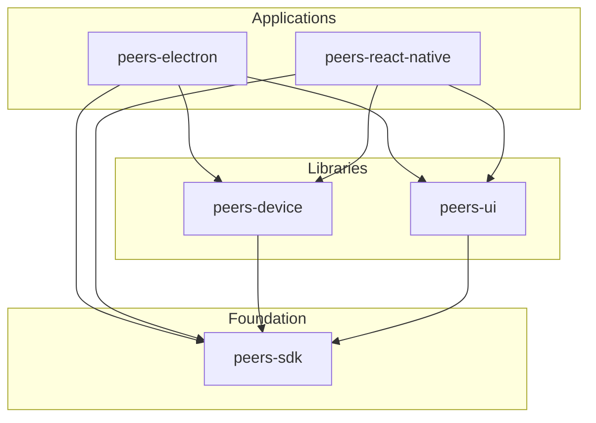

# Project Stack

This diagram shows the architecture of the Peers project stack:

## Stack Layers

- **peers-sdk**: Foundation layer providing core functionality
- **peers-device**: Device management layer built on peers-sdk
- **peers-ui**: User interface components built on peers-sdk
- **peers-electron**: Desktop application built on peers-device, peers-ui, and peers-sdk
- **peers-react-native**: Mobile application built on peers-device, peers-ui, and peers-sdk