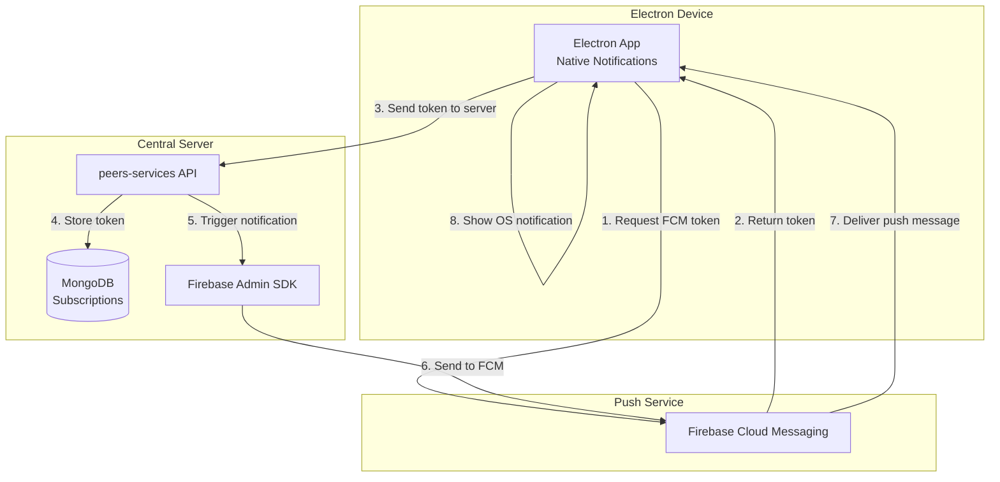
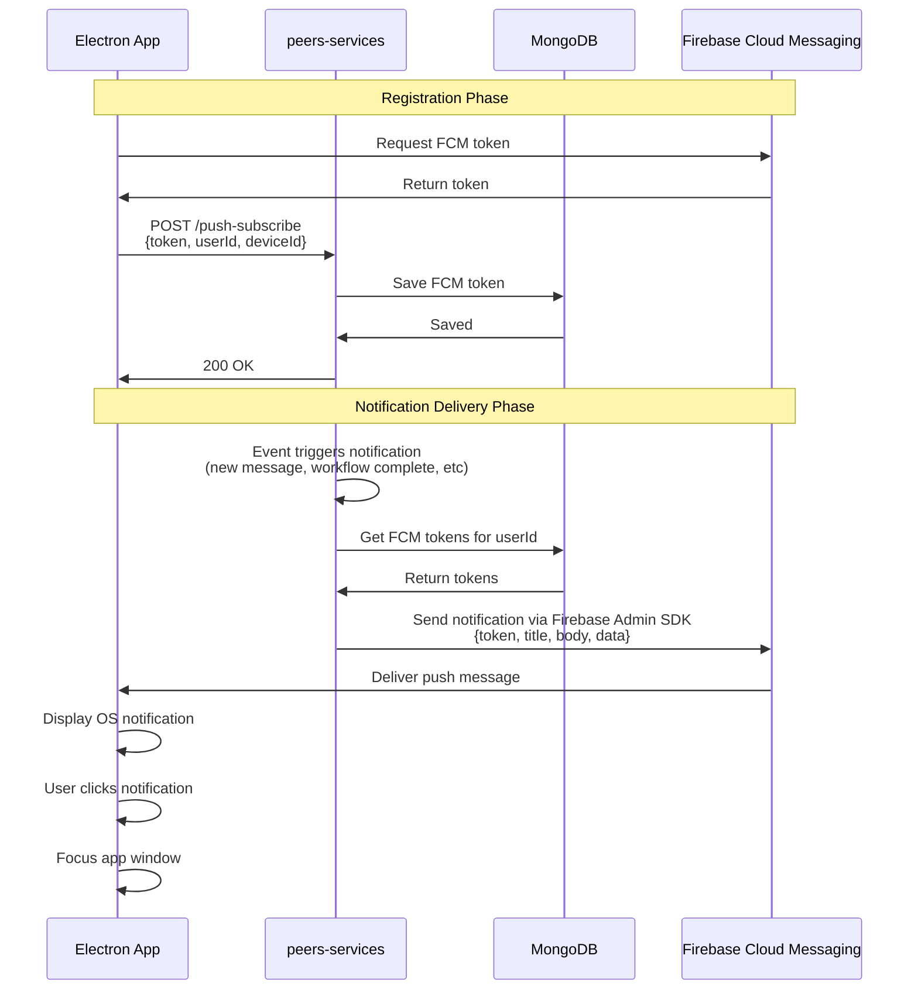

# Push Notifications for Electron

## System Flow

```mermaid
flowchart TB
    subgraph "Electron Device"
        Electron[Electron App<br/>Native Notifications]
    end

    subgraph "Central Server"
        API[peers-services API]
        DB[(MongoDB<br/>Subscriptions)]
        FCMAdmin[Firebase Admin SDK]
    end

    subgraph "Push Service"
        FCM[Firebase Cloud Messaging]
    end

    Electron -->|1. Request FCM token| FCM
    FCM -->|2. Return token| Electron
    Electron -->|3. Send token to server| API
    API -->|4. Store token| DB

    API -->|5. Trigger notification| FCMAdmin
    FCMAdmin -->|6. Send to FCM| FCM
    FCM -->|7. Deliver push message| Electron
    Electron -->|8. Show OS notification| Electron
```

## Sequence Diagram

```mermaid
sequenceDiagram
    participant Electron as Electron App
    participant Server as peers-services
    participant DB as MongoDB
    participant FCM as Firebase Cloud Messaging

    Note over Electron,FCM: Registration Phase
    Electron->>FCM: Request FCM token
    FCM->>Electron: Return token

    Electron->>Server: POST /push-subscribe<br/>{token, userId, deviceId}
    Server->>DB: Save FCM token
    DB->>Server: Saved
    Server->>Electron: 200 OK

    Note over Electron,FCM: Notification Delivery Phase
    Server->>Server: Event triggers notification<br/>(new message, workflow complete, etc)
    Server->>DB: Get FCM tokens for userId
    DB->>Server: Return tokens

    Server->>FCM: Send notification via Firebase Admin SDK<br/>{token, title, body, data}
    FCM->>Electron: Deliver push message

    Electron->>Electron: Display OS notification

    Electron->>Electron: User clicks notification
    Electron->>Electron: Focus app window
```
