# Peers Architecture

## System Overview

```mermaid
graph TD
    User[👤 User]
    
    PersonalGroup[🏠 Personal Group]
    PersonalDB[(Personal SQLite DB)]
    GroupsTable[Groups Table]
    
    Group1[👥 Group 1]
    Group2[👥 Group 2]
    GroupN[👥 Group N]
    
    Group1DB[(Group 1 SQLite DB)]
    Group1Members[Group1: GroupMembers]
    Group2DB[(Group 2 SQLite DB)]
    Group2Members[Group2: GroupMembers]
    GroupNDB[(Group N SQLite DB)]
    GroupNMembers[GroupN: GroupMembers]
    
    %% User has default personal group
    User -->|has default| PersonalGroup
    PersonalGroup -->|maps to| PersonalDB
    PersonalDB -->|contains| GroupsTable
    
    %% Groups table contains references to other groups
    GroupsTable -->|references| Group1
    GroupsTable -->|references| Group2
    GroupsTable -->|references| GroupN
    
    %% Each group has its own SQLite DB with GroupMembers
    Group1 -->|maps to| Group1DB
    Group1DB -->|contains| Group1Members
    Group2 -->|maps to| Group2DB
    Group2DB -->|contains| Group2Members
    GroupN -->|maps to| GroupNDB
    GroupNDB -->|contains| GroupNMembers
    
    %% Styling
    classDef userClass fill:#e1f5fe
    classDef groupClass fill:#e8f5e8
    classDef dbClass fill:#fff3e0
    classDef tableClass fill:#f3e5f5
    
    class User userClass
    class PersonalGroup,Group1,Group2,GroupN groupClass
    class PersonalDB,Group1DB,Group2DB,GroupNDB dbClass
    class GroupsTable,Group1Members,Group2Members,GroupNMembers tableClass
```

## Key Architecture Principles

### Group Structure
- **Personal Group**: Every user starts with a default personal group
- **Group Database Mapping**: Each group (including personal) maps to its own SQLite database
- **Groups Table**: Located in the personal SQLite DB, contains references to all groups the user belongs to

### Database Architecture
- **Personal SQLite DB**: Contains the Groups table and personal data
- **Group SQLite DBs**: Separate databases for each group the user participates in
- **Scalability**: Typical user expected to have 10-20 groups, though system can handle hundreds

### Data Distribution & Responsibility
- **Groups Table** (in user's personal DB): Acts as an index/registry of groups the user wants to participate in
- **GroupMembers Table** (in each group's DB): Authoritative record of users actually permitted in the group
- **Responsibility Separation**: 
  - User controls which groups they want to join (Groups table)
  - Group controls which users are actually members (GroupMembers table)
- Actual group data and conversations stored in respective group databases
- This separation allows for efficient data management and access control