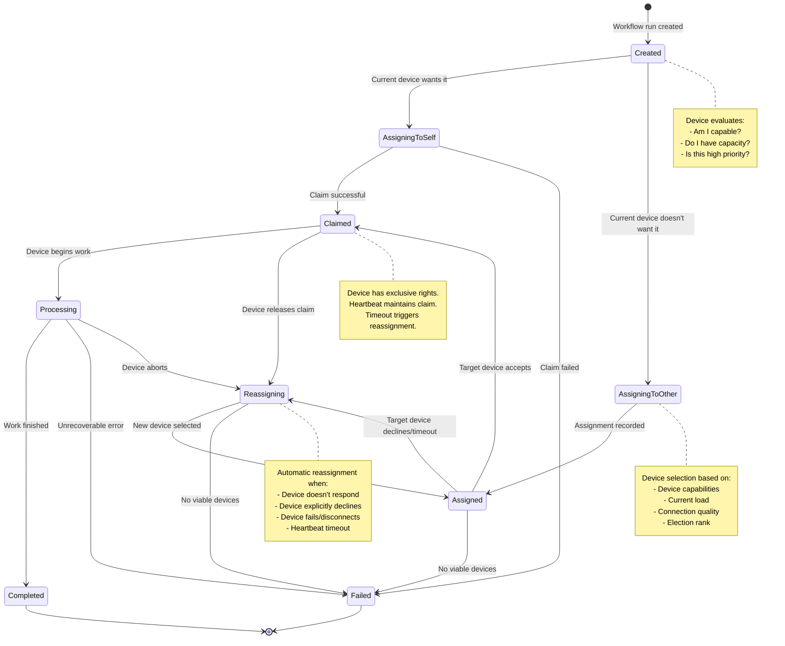

# Workflow Run Assignment - Exclusive Device Access

## Overview

This document explores an improved mechanism for assigning exclusive access to workflow runs among peer devices. The current data-lock system (implemented in `peers-sdk/src/data/data-locks.ts`) works but has several limitations:

- **Slow**: Requires waiting for acknowledgments from 70% of connected peers
- **Expensive**: Creates significant traffic and contention, especially when all peers attempt simultaneous operations
- **Complex**: Relies on acknowledgment counting and timestamp-based conflict resolution
- **Error-prone**: Race conditions in the "dead period" and renewal logic

## Current Data-Lock System Issues

From `data-locks.ts:11-27`:

> This works by waiting for a majority of peers to acknowledge the lock. Once that happens it is considered "well propagated" but that's not actually guaranteed.
>
> This system works okay for a few peers but it won't scale well when _all_ the peers are trying to do something like emit a scheduled event at the same time. They'll all try to acquire the lock at the same time and even if this works, it'll create a ton of traffic and contention.
>
> We already have an election system for preferred connections. This feels like it could be solved in a similar way, maybe by just using the existing elections.

## Proposed Workflow Run Assignment Model

### Core Principles

1. **Assignment at Creation**: When a workflow run is created, the creating device immediately assigns it to a specific device
2. **Local Preference**: The creating device prefers to assign work to itself (if capable and willing)
3. **Delegation Chain**: Devices can pass work to other devices if they cannot or will not process it
4. **Definitive States**: Clear state transitions with no ambiguity about ownership
5. **Lightweight Protocol**: Minimal network chatter; assignments are declarative, not negotiated

### State Diagram



### Detailed State Descriptions

#### **Created**
- **Entry**: Workflow run record is inserted into the database
- **Owner**: Creating device
- **Actions**:
  - Creating device evaluates whether it wants to process this run
  - Decision based on: device type, current load, battery status, network conditions, run priority
- **Transitions**:
  - → `AssigningToSelf`: Device decides to claim it
  - → `AssigningToOther`: Device decides to delegate

#### **AssigningToSelf**
- **Entry**: Device has decided to claim the workflow run for itself
- **Owner**: Creating device (attempting self-assignment)
- **Actions**:
  - Update workflow run record: `{ assignedTo: thisDeviceId, assignedAt: timestamp }`
  - Set claim expiration: `claimExpiresAt: now + CLAIM_TIMEOUT`
- **Transitions**:
  - → `Claimed`: Record updated successfully, no conflicts
  - → `Failed`: Another device claimed it first (conflict) or database error

#### **AssigningToOther**
- **Entry**: Device has selected another device to handle this workflow run
- **Owner**: Creating device (delegating)
- **Actions**:
  - Select target device using selection algorithm
  - Update workflow run record: `{ assignedTo: targetDeviceId, assignedAt: timestamp, assignedBy: thisDeviceId }`
  - Set assignment timeout: `assignmentExpiresAt: now + ASSIGNMENT_TIMEOUT`
- **Transitions**:
  - → `Assigned`: Record updated successfully

#### **Assigned**
- **Entry**: Workflow run has been assigned to a specific device
- **Owner**: Target device (passive - waiting for acceptance)
- **Actions**:
  - Target device sees assignment (via sync or subscription)
  - Target device evaluates: Can I/should I handle this?
  - If yes: transition to `Claimed`
  - If no: transition to `Reassigning`
  - If no response within timeout: automatic transition to `Reassigning`
- **Transitions**:
  - → `Claimed`: Target device accepts and claims
  - → `Reassigning`: Target declines, times out, or is unavailable
  - → `Failed`: No alternative devices available

#### **Claimed**
- **Entry**: A device has accepted exclusive responsibility for the workflow run
- **Owner**: Claiming device (active ownership)
- **Actions**:
  - Device updates record: `{ claimedAt: timestamp, status: 'claimed' }`
  - Device starts heartbeat: periodic updates to `lastHeartbeatAt`
  - Device prepares to begin processing
- **Heartbeat**: Device must update `lastHeartbeatAt` every `HEARTBEAT_INTERVAL` (e.g., 30s)
- **Timeout**: If `now - lastHeartbeatAt > HEARTBEAT_TIMEOUT` (e.g., 90s), automatic transition to `Reassigning`
- **Transitions**:
  - → `Processing`: Device begins execution
  - → `Reassigning`: Device releases claim or heartbeat times out
  - → `Failed`: Unrecoverable error during claim period

#### **Reassigning**
- **Entry**: Previous assignment failed or was released
- **Owner**: Coordinating device (may be different from original creator)
- **Actions**:
  - Evaluate why reassignment is needed (timeout, decline, error)
  - Select new target device (excluding failed devices)
  - Update record: `{ assignedTo: newDeviceId, assignedAt: timestamp, previousAssignments: [...] }`
  - Increment retry counter
- **Transitions**:
  - → `Assigned`: New device selected
  - → `Failed`: Max retries exceeded or no viable devices remain

#### **Processing**
- **Entry**: Device has started executing the workflow run
- **Owner**: Processing device (active execution)
- **Actions**:
  - Device continues heartbeat updates
  - Device executes workflow steps
  - Device updates progress: `{ progress: { step: X, total: Y } }`
- **Heartbeat**: Continues from `Claimed` state
- **Transitions**:
  - → `Completed`: All steps executed successfully
  - → `Failed`: Unrecoverable error during execution
  - → `Reassigning`: Device aborts processing (e.g., low battery, user intervention)

#### **Completed**
- **Entry**: Workflow run finished successfully
- **Owner**: Processing device (final update)
- **Actions**:
  - Device updates record: `{ status: 'completed', completedAt: timestamp }`
  - Device stops heartbeat
  - Record is now read-only
- **Terminal State**: No further transitions

#### **Failed**
- **Entry**: Workflow run cannot be completed
- **Owner**: Last responsible device
- **Actions**:
  - Device updates record: `{ status: 'failed', failedAt: timestamp, error: reason }`
  - Record is now read-only (until potential retry logic)
- **Terminal State**: No further transitions (unless manual retry)

### Device Selection Algorithm

When assigning to another device (`AssigningToOther` or `Reassigning`), use this algorithm:

```typescript
function selectDevice(
  workflowRun: IWorkflowRun,
  availableDevices: IPeerDevice[],
  excludeDevices: string[] = []
): IPeerDevice | undefined {

  const candidates = availableDevices
    .filter(d => !excludeDevices.includes(d.deviceId))
    .filter(d => isCapable(d, workflowRun))
    .filter(d => isReachable(d));

  if (candidates.length === 0) return undefined;

  // Score each device
  const scored = candidates.map(device => ({
    device,
    score: calculateScore(device, workflowRun)
  }));

  // Sort by score descending
  scored.sort((a, b) => b.score - a.score);

  return scored[0].device;
}

function calculateScore(device: IPeerDevice, workflowRun: IWorkflowRun): number {
  let score = 0;

  // Prefer devices with lower current load
  score += (1.0 - device.currentLoad) * 40;

  // Prefer devices with better connection quality
  score += device.connectionQuality * 30;

  // Prefer higher election rank (if using elections)
  score += device.electionRank * 20;

  // Prefer devices with relevant capabilities
  if (hasRelevantCapabilities(device, workflowRun)) {
    score += 10;
  }

  return score;
}
```

### Comparison to Current Data-Lock System

| Aspect | Current Data-Locks | Proposed Workflow Assignment |
|--------|-------------------|------------------------------|
| **Acquisition Time** | 20s timeout waiting for acknowledgments | Immediate (single write) |
| **Network Traffic** | High (acknowledgments from 70% of peers) | Minimal (single assignment record) |
| **Scalability** | Poor (contention with many peers) | Good (declarative assignments) |
| **Conflict Resolution** | Timestamp-based with majority voting | First-write-wins (database-level) |
| **Heartbeat Required** | No (lock has expiration) | Yes (maintains claim validity) |
| **Failure Detection** | Lock expiration (5min default) | Heartbeat timeout (90s default) |
| **Reassignment** | Manual (acquire new lock) | Automatic (state machine) |
| **Use Case** | Generic record locking | Specific to workflow run processing |

### Implementation Sketch

```typescript
// Add to IWorkflowRun schema
export const workflowRunSchema = z.object({
  workflowRunId: zodPeerId,
  workflowId: z.string(),
  status: z.enum(['created', 'assigned', 'claimed', 'processing', 'completed', 'failed', 'reassigning']),

  // Assignment tracking
  assignedTo: zodPeerId.optional(),
  assignedBy: zodPeerId.optional(),
  assignedAt: z.number().optional(),
  claimedAt: z.number().optional(),
  lastHeartbeatAt: z.number().optional(),

  // Reassignment history
  previousAssignments: z.array(z.object({
    deviceId: zodPeerId,
    assignedAt: z.number(),
    reason: z.string() // 'timeout', 'declined', 'failed', 'released'
  })).optional(),

  // Timeouts
  assignmentExpiresAt: z.number().optional(),
  claimExpiresAt: z.number().optional(),

  // Execution tracking
  startedAt: z.number().optional(),
  completedAt: z.number().optional(),
  failedAt: z.number().optional(),
  error: z.string().optional(),

  // Workflow data
  input: z.record(z.any()).optional(),
  output: z.record(z.any()).optional(),
});
```

### Advantages

1. **Fast Assignment**: No waiting for peer acknowledgments
2. **Low Overhead**: Single database write per assignment
3. **Self-Healing**: Automatic reassignment on timeout or failure
4. **Clear Ownership**: Always exactly one device responsible at any time
5. **Graceful Degradation**: Works with any number of peers
6. **Audit Trail**: Complete history of assignments in `previousAssignments`
7. **Leverages Existing Patterns**: Can integrate with election system for device selection

### Edge Cases & Considerations

#### **Split Brain Scenarios**
- If network partitions, two devices might both claim the same workflow run
- Resolution: When partition heals, use `assignedAt` timestamp (earlier wins)
- Loser device detects conflict and either releases or escalates to user

#### **Device Disappears After Claiming**
- Heartbeat timeout (e.g., 90s) detects unresponsive device
- Automatic transition to `Reassigning` state
- New device selected and work continues

#### **All Devices Decline**
- After exhausting all candidates, workflow run transitions to `Failed`
- User notification or manual intervention required
- Could implement exponential backoff retry

#### **High-Priority Work**
- Could add `priority` field to workflow runs
- High-priority runs can preempt lower-priority work
- Device selection algorithm considers priority

#### **Device Joins Mid-Process**
- New device sees existing assignments and respects them
- Can become candidate for future assignments or reassignments

### Integration with Elections

The existing election system (mentioned in `data-locks.ts:23`) could enhance device selection:

```typescript
function selectDeviceWithElection(
  workflowRun: IWorkflowRun,
  availableDevices: IPeerDevice[]
): IPeerDevice | undefined {

  // Get current elected coordinator
  const coordinator = getElectedCoordinator(availableDevices);

  if (coordinator && isCapable(coordinator, workflowRun)) {
    // Prefer coordinator for workflow orchestration
    return coordinator;
  }

  // Fall back to score-based selection
  return selectDevice(workflowRun, availableDevices);
}
```

### Next Steps

1. **Prototype Implementation**: Build `WorkflowRunsTable` with state machine logic
2. **Heartbeat Service**: Background service to update `lastHeartbeatAt` for claimed runs
3. **Monitor Service**: Background service to detect timeouts and trigger reassignments
4. **Device Selection Tuning**: Gather metrics to optimize scoring algorithm
5. **Testing**: Simulate network partitions, device failures, and high-concurrency scenarios
6. **Migration Path**: Strategy for moving from data-locks to workflow run assignment

### Open Questions

1. Should heartbeat interval be configurable per workflow type?
2. How to handle workflows that span multiple devices (parallel execution)?
3. Should there be a "pause" state for user intervention?
4. How to prioritize work when device has multiple claimed runs?
5. Should reassignment be capped (max retries before permanent failure)?

---

**Related Files:**
- Current implementation: `peers-sdk/src/data/data-locks.ts`
- Workflow types: `peers-sdk/src/workflows/` (assumed location)
- Peer device types: `peers-sdk/src/types/peer-device.ts`
