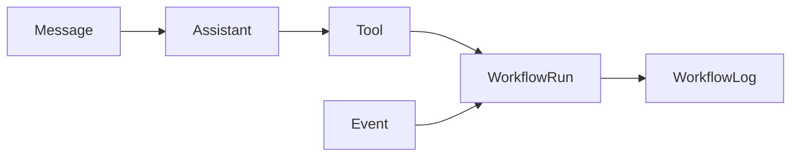
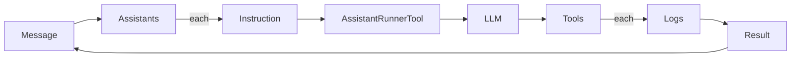
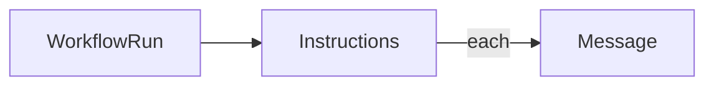
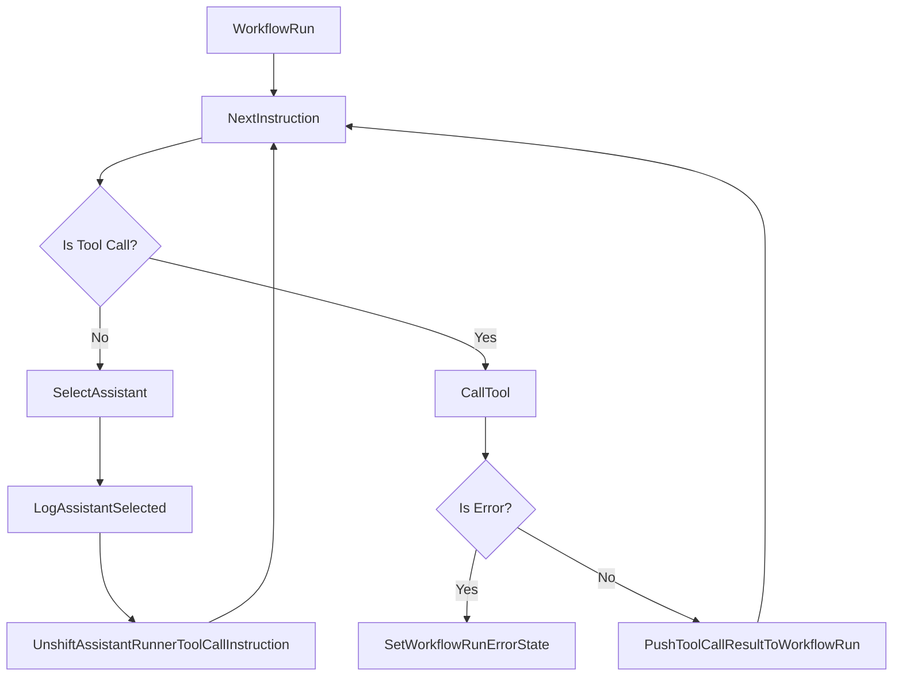
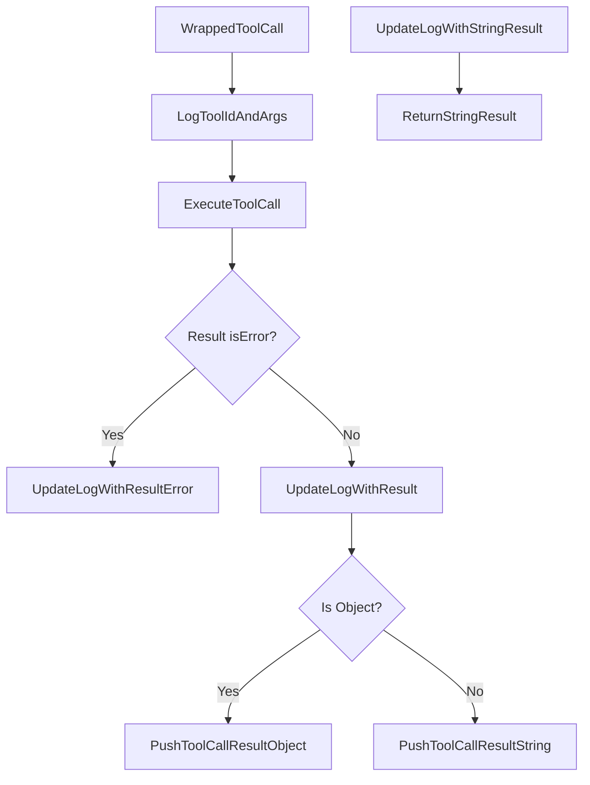

```mermai
graph LR
  A[Square] --> B((Circle))
  A --> C(Round Rect)
  B --> D{Rhombus}
  C --> D
```




### Message Flow



### Workflow Run Flow


### Logging in Workflow Run Processor


### Logging in Tool Call 
This is done automaticaly as part of the tool wrapper


