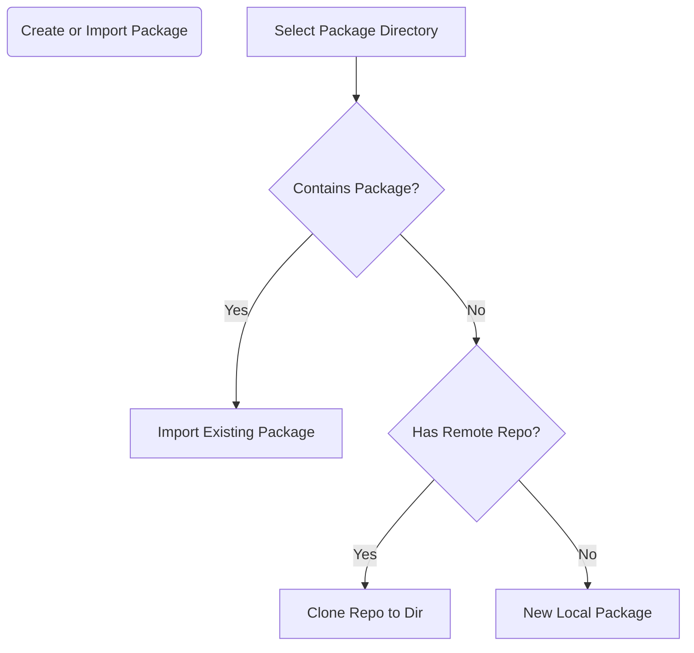

Shortcuts
- new local package with given name at default location
- import package from report repo, clone to default location 

The above are also almost always going to be what the user is trying to do.  
- don't allow specifying anything besides the root packages dir
  - this is a global variable for each device
- now we just have to ask, is this a _new_ local package or is it an existing remot.
  - will we never want to import an existing local package?  How would we do that?
  - how do we sync changes? 
  
- for remote packages, how do we sync them?  Push a button?  
